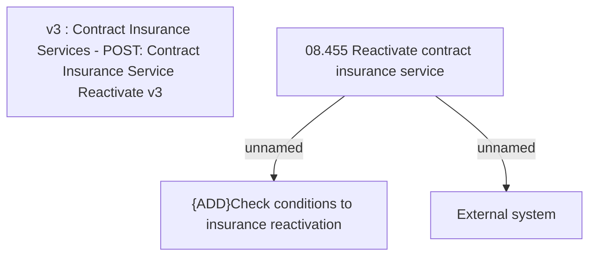

# Contract insurance reactivation

```mermaid
graph TD
    ADD_Check_conditions_to_insurance_reactivation["{ADD}Check conditions to insurance reactivation"]
    v3_Contract_Insurance_Services_POST_Contract_Insurance_Servi["v3 : Contract Insurance Services - POST: Contract Insurance Service Reactivate v3"]
    n_08_455_Reactivate_contract_insurance_service["08.455 Reactivate contract insurance service"]
    External_system["External system"]
    n_08_455_Reactivate_contract_insurance_service -->|unnamed| ADD_Check_conditions_to_insurance_reactivation
    n_08_455_Reactivate_contract_insurance_service -->|unnamed| External_system
```
