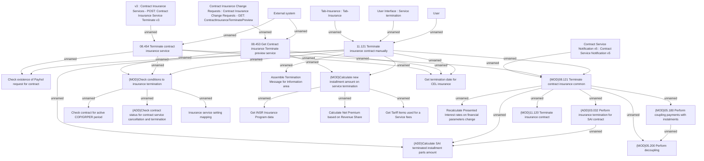

# Contract insurance termination

```mermaid
graph TD
    ADD_03_032_Perform_insurance_termination_for_SAI_contract["{ADD}03.032 Perform insurance termination for SAI contract"]
    Contract_Service_Notification_v5_Contract_Service_Notificati["Contract Service Notification v5 : Contract Service Notification v5"]
    ADD_Calculate_SAI_terminated_installment_parts_amount["{ADD}Calculate SAI terminated installment parts amount"]
    Check_contract_for_active_COP_GRPER_period["Check contract for active COP/GRPER period"]
    ADD_Check_contract_status_for_contract_service_cancellation_["{ADD}Check contract status for contract service cancellation and termination"]
    v3_Contract_Insurance_Services_POST_Contract_Insurance_Servi["v3 : Contract Insurance Services - POST: Contract Insurance Service Terminate v3"]
    Check_existence_of_Payhol_request_for_contract["Check existence of Payhol request for contract"]
    Insurance_service_setting_mapping["Insurance service setting mapping"]
    Get_INSR_Insurance_Program_data["Get INSR Insurance Program data"]
    Calculate_Net_Premium_based_on_Revenue_Share["Calculate Net Premium based on Revenue Share"]
    MOD_Check_conditions_to_insurance_termination["{MOD}Check conditions to insurance termination"]
    Contract_Insurance_Change_Requests_Contract_Insurance_Change["Contract Insurance Change Requests : Contract Insurance Change Requests - GET: ContractInsuranceTerminatePreview"]
    n_08_454_Terminate_contract_insurance_service["08.454 Terminate contract insurance service"]
    n_08_453_Get_Contract_insurance_Terminate_preview_service["08.453 Get Contract insurance Terminate preview service"]
    External_system["External system"]
    MOD_08_121_Terminate_contract_insurance_common["{MOD}08.121 Terminate contract insurance common"]
    Assemble_Termination_Message_for_Information_area["Assemble Termination Message for Information area"]
    MOD_Calculate_new_installment_amount_on_service_termination["{MOD}Calculate new installment amount on service termination"]
    User_Interface_Service_termination["User Interface : Service termination"]
    Tab_Insurance_Tab_Insurance["Tab-Insurance : Tab-Insurance"]
    Get_Tariff_Items_used_for_a_Service_fees["Get Tariff Items used for a Service fees"]
    Recalculate_Presented_Interest_rates_on_financial_parameters["Recalculate Presented Interest rates on financial parameters change"]
    MOD_05_180_Perform_coupling_payments_with_instalments["{MOD}05.180 Perform coupling payments with instalments"]
    MOD_05_200_Perform_decoupling["{MOD}05.200 Perform decoupling"]
    n_11_121_Terminate_insurance_contract_manually["11.121 Terminate insurance contract manually"]
    Get_termination_date_for_CEL_insurance["Get termination date for CEL insurance"]
    User["User"]
    MOD_11_120_Terminate_insurance_contract["{MOD}11.120 Terminate insurance contract"]
    n_08_454_Terminate_contract_insurance_service -->|unnamed| Get_termination_date_for_CEL_insurance
    Contract_Service_Notification_v5_Contract_Service_Notificati -->|unnamed| MOD_08_121_Terminate_contract_insurance_common
    MOD_08_121_Terminate_contract_insurance_common -->|unnamed| ADD_03_032_Perform_insurance_termination_for_SAI_contract
    n_08_453_Get_Contract_insurance_Terminate_preview_service -->|unnamed| MOD_Check_conditions_to_insurance_termination
    n_08_453_Get_Contract_insurance_Terminate_preview_service -->|unnamed| Get_termination_date_for_CEL_insurance
    MOD_08_121_Terminate_contract_insurance_common -->|unnamed| MOD_05_180_Perform_coupling_payments_with_instalments
    n_08_454_Terminate_contract_insurance_service -->|unnamed| MOD_Check_conditions_to_insurance_termination
    MOD_08_121_Terminate_contract_insurance_common -->|unnamed| MOD_05_200_Perform_decoupling
    n_08_454_Terminate_contract_insurance_service -->|unnamed| MOD_08_121_Terminate_contract_insurance_common
    n_08_454_Terminate_contract_insurance_service -->|unnamed| Check_existence_of_Payhol_request_for_contract
    Contract_Insurance_Change_Requests_Contract_Insurance_Change -->|unnamed| n_08_453_Get_Contract_insurance_Terminate_preview_service
    MOD_Check_conditions_to_insurance_termination -->|unnamed| ADD_Check_contract_status_for_contract_service_cancellation_
    MOD_Check_conditions_to_insurance_termination -->|unnamed| Insurance_service_setting_mapping
    MOD_Check_conditions_to_insurance_termination -->|unnamed| Check_contract_for_active_COP_GRPER_period
    v3_Contract_Insurance_Services_POST_Contract_Insurance_Servi -->|unnamed| n_08_454_Terminate_contract_insurance_service
    n_08_453_Get_Contract_insurance_Terminate_preview_service -->|unnamed| MOD_Calculate_new_installment_amount_on_service_termination
    MOD_05_180_Perform_coupling_payments_with_instalments -->|unnamed| MOD_05_200_Perform_decoupling
    n_11_121_Terminate_insurance_contract_manually -->|unnamed| ADD_Calculate_SAI_terminated_installment_parts_amount
    n_11_121_Terminate_insurance_contract_manually -->|unnamed| Check_existence_of_Payhol_request_for_contract
    n_11_121_Terminate_insurance_contract_manually -->|unnamed| MOD_08_121_Terminate_contract_insurance_common
    n_11_121_Terminate_insurance_contract_manually -->|unnamed| Assemble_Termination_Message_for_Information_area
    n_11_121_Terminate_insurance_contract_manually -->|unnamed| MOD_Calculate_new_installment_amount_on_service_termination
    MOD_08_121_Terminate_contract_insurance_common -->|unnamed| Recalculate_Presented_Interest_rates_on_financial_parameters
    n_11_121_Terminate_insurance_contract_manually -->|unnamed| MOD_Check_conditions_to_insurance_termination
    Tab_Insurance_Tab_Insurance -->|unnamed| n_11_121_Terminate_insurance_contract_manually
    User_Interface_Service_termination -->|unnamed| n_11_121_Terminate_insurance_contract_manually
    MOD_Calculate_new_installment_amount_on_service_termination -->|unnamed| Get_Tariff_Items_used_for_a_Service_fees
    MOD_Calculate_new_installment_amount_on_service_termination -->|unnamed| Get_INSR_Insurance_Program_data
    MOD_Calculate_new_installment_amount_on_service_termination -->|unnamed| Calculate_Net_Premium_based_on_Revenue_Share
    MOD_08_121_Terminate_contract_insurance_common -->|unnamed| MOD_11_120_Terminate_insurance_contract
    MOD_08_121_Terminate_contract_insurance_common -->|unnamed| ADD_Calculate_SAI_terminated_installment_parts_amount
    n_11_121_Terminate_insurance_contract_manually -->|unnamed| Get_termination_date_for_CEL_insurance
    ADD_03_032_Perform_insurance_termination_for_SAI_contract -->|unnamed| ADD_Calculate_SAI_terminated_installment_parts_amount
    External_system -->|unnamed| n_08_453_Get_Contract_insurance_Terminate_preview_service
    User -->|unnamed| n_11_121_Terminate_insurance_contract_manually
    External_system -->|unnamed| n_08_454_Terminate_contract_insurance_service
```
