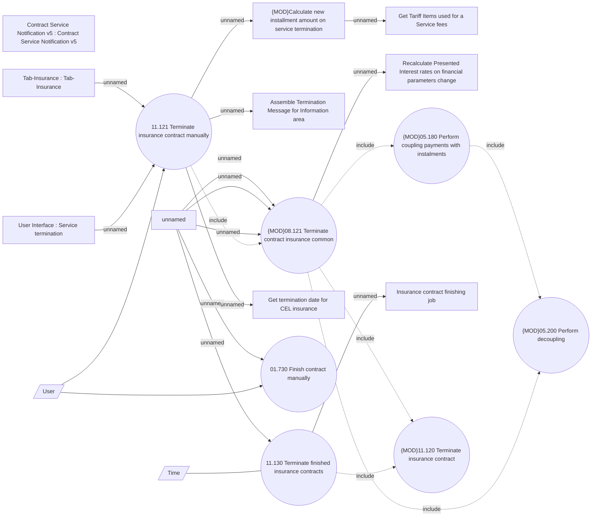

# Termination of Insurance contract options

- **Diagram Type**: Use Case
- **Package**: HomerSelect/BSL/Analysis Model/Insurance/Insurance Contract/Insurance finishing/Use case model
- **Diagram ID**: 164425
- **Elements**: 21
- **Connectors**: 22

