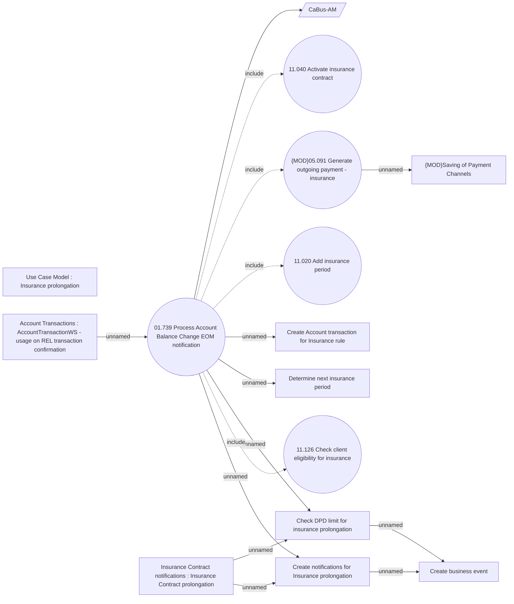

# Insurance based on AccountBalanceChange EOM event

- **Diagram Type**: Use Case
- **Package**: HomerSelect/BSL/Analysis Model/Insurance/Insurance Contract/REL Insurance features
- **Diagram ID**: 164077
- **Elements**: 15
- **Connectors**: 15

