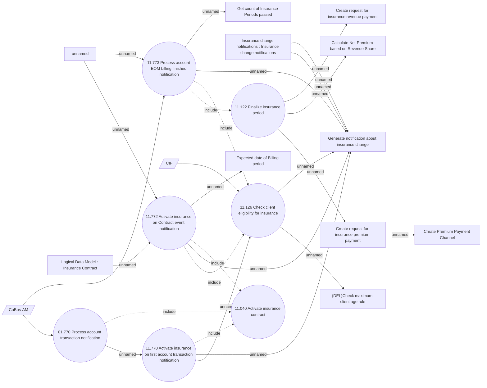

# Insurance based on EOM message

- **Diagram Type**: Use Case
- **Package**: HomerSelect/BSL/Analysis Model/Insurance/Insurance Contract/REL Insurance features
- **Diagram ID**: 164074
- **Elements**: 22
- **Connectors**: 27

