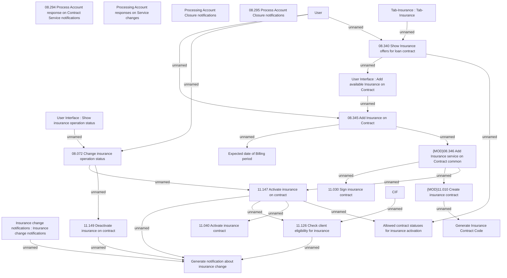

# Insurance on REL Contract management

```mermaid
graph TD
    n_08_294_Process_Account_response_on_Contract_Service_notifi["08.294 Process Account response on Contract Service notifications"]
    Processing_Account_responses_on_Service_changes["Processing Account responses on Service changes"]
    Processing_Account_Closure_notifications["Processing Account Closure notifications"]
    n_08_295_Process_Account_Closure_notifications["08.295 Process Account Closure notifications"]
    Insurance_change_notifications_Insurance_change_notification["Insurance change notifications : Insurance change notifications"]
    Allowed_contract_statuses_for_insurance_activation["Allowed contract statuses for insurance activation"]
    MOD_08_346_Add_Insurance_service_on_Contract_common["{MOD}08.346 Add Insurance service on Contract common"]
    n_11_030_Sign_insurance_contract["11.030 Sign insurance contract"]
    User_Interface_Show_insurance_operation_status["User Interface : Show insurance operation status"]
    n_08_072_Change_insurance_operation_status["08.072 Change insurance operation status"]
    n_11_149_Deactivate_insurance_on_contract["11.149 Deactivate insurance on contract"]
    n_11_147_Activate_insurance_on_contract["11.147 Activate insurance on contract"]
    Generate_Insurance_Contract_Code["Generate Insurance Contract Code"]
    MOD_11_010_Create_insurance_contract["{MOD}11.010 Create insurance contract"]
    Tab_Insurance_Tab_Insurance["Tab-Insurance : Tab-Insurance"]
    User_Interface_Add_available_Insurance_on_Contract["User Interface : Add available Insurance on Contract"]
    Expected_date_of_Billing_period["Expected date of Billing period"]
    CIF["CIF"]
    n_08_345_Add_Insurance_on_Contract["08.345 Add Insurance on Contract"]
    n_08_340_Show_Insurance_offers_for_loan_contract["08.340 Show Insurance offers for loan contract"]
    User["User"]
    n_11_040_Activate_insurance_contract["11.040 Activate insurance contract"]
    n_11_126_Check_client_eligibility_for_insurance["11.126 Check client eligibility for insurance"]
    Generate_notification_about_insurance_change["Generate notification about insurance change"]
    n_11_147_Activate_insurance_on_contract -->|unnamed| Allowed_contract_statuses_for_insurance_activation
    User_Interface_Show_insurance_operation_status -->|unnamed| n_08_072_Change_insurance_operation_status
    n_08_072_Change_insurance_operation_status -->|unnamed| n_11_149_Deactivate_insurance_on_contract
    MOD_08_346_Add_Insurance_service_on_Contract_common -->|unnamed| n_11_147_Activate_insurance_on_contract
    n_08_072_Change_insurance_operation_status -->|unnamed| n_11_147_Activate_insurance_on_contract
    n_11_149_Deactivate_insurance_on_contract -->|unnamed| Generate_notification_about_insurance_change
    User_Interface_Add_available_Insurance_on_Contract -->|unnamed| n_08_345_Add_Insurance_on_Contract
    Tab_Insurance_Tab_Insurance -->|unnamed| n_08_340_Show_Insurance_offers_for_loan_contract
    n_11_147_Activate_insurance_on_contract -->|unnamed| n_11_040_Activate_insurance_contract
    n_11_147_Activate_insurance_on_contract -->|unnamed| n_11_126_Check_client_eligibility_for_insurance
    n_11_147_Activate_insurance_on_contract -->|unnamed| Generate_notification_about_insurance_change
    Insurance_change_notifications_Insurance_change_notification -->|unnamed| Generate_notification_about_insurance_change
    User -->|unnamed| n_08_340_Show_Insurance_offers_for_loan_contract
    User -->|unnamed| n_08_072_Change_insurance_operation_status
    User -->|unnamed| n_08_345_Add_Insurance_on_Contract
    CIF -->|unnamed| n_11_126_Check_client_eligibility_for_insurance
    MOD_11_010_Create_insurance_contract -->|unnamed| Generate_Insurance_Contract_Code
    n_11_126_Check_client_eligibility_for_insurance -->|unnamed| Generate_notification_about_insurance_change
    n_08_345_Add_Insurance_on_Contract -->|unnamed| MOD_08_346_Add_Insurance_service_on_Contract_common
    MOD_08_346_Add_Insurance_service_on_Contract_common -->|unnamed| MOD_11_010_Create_insurance_contract
    MOD_08_346_Add_Insurance_service_on_Contract_common -->|unnamed| n_11_030_Sign_insurance_contract
    n_08_345_Add_Insurance_on_Contract -->|unnamed| Expected_date_of_Billing_period
    n_08_340_Show_Insurance_offers_for_loan_contract -->|unnamed| Allowed_contract_statuses_for_insurance_activation
    n_08_340_Show_Insurance_offers_for_loan_contract -->|unnamed| User_Interface_Add_available_Insurance_on_Contract
```
