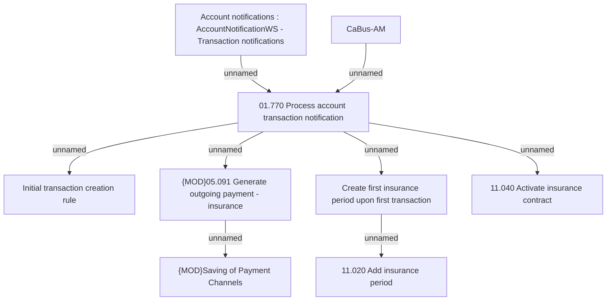

# Processing of first transaction notification

```mermaid
graph TD
    MOD_Saving_of_Payment_Channels["{MOD}Saving of Payment Channels"]
    Initial_transaction_creation_rule["Initial transaction creation rule"]
    Create_first_insurance_period_upon_first_transaction["Create first insurance period upon first transaction"]
    n_11_020_Add_insurance_period["11.020 Add insurance period"]
    MOD_05_091_Generate_outgoing_payment_insurance["{MOD}05.091 Generate outgoing payment - insurance"]
    n_11_040_Activate_insurance_contract["11.040 Activate insurance contract"]
    Account_notifications_AccountNotificationWS_Transaction_noti["Account notifications : AccountNotificationWS - Transaction notifications"]
    n_01_770_Process_account_transaction_notification["01.770 Process account transaction notification"]
    CaBus_AM["CaBus-AM"]
    Account_notifications_AccountNotificationWS_Transaction_noti -->|unnamed| n_01_770_Process_account_transaction_notification
    n_01_770_Process_account_transaction_notification -->|unnamed| n_11_040_Activate_insurance_contract
    n_01_770_Process_account_transaction_notification -->|unnamed| MOD_05_091_Generate_outgoing_payment_insurance
    n_01_770_Process_account_transaction_notification -->|unnamed| Create_first_insurance_period_upon_first_transaction
    n_01_770_Process_account_transaction_notification -->|unnamed| Initial_transaction_creation_rule
    CaBus_AM -->|unnamed| n_01_770_Process_account_transaction_notification
    MOD_05_091_Generate_outgoing_payment_insurance -->|unnamed| MOD_Saving_of_Payment_Channels
    Create_first_insurance_period_upon_first_transaction -->|unnamed| n_11_020_Add_insurance_period
```
