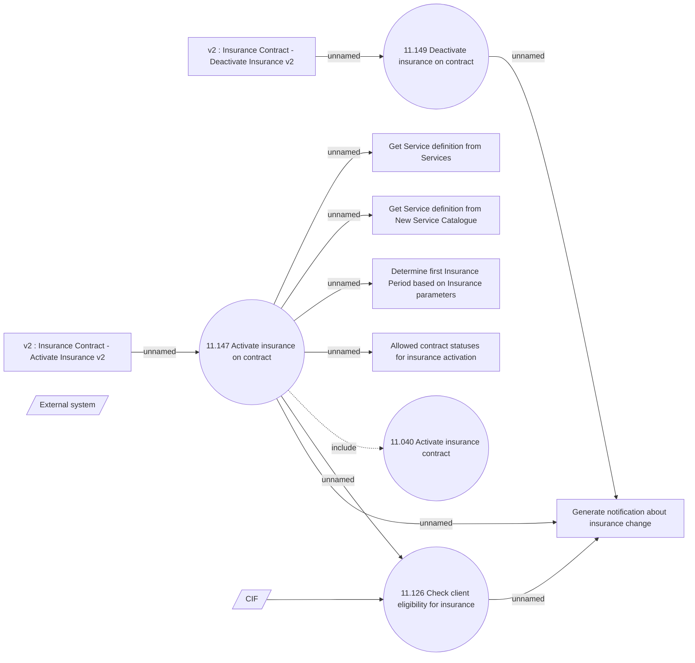

# Changing insurance operation status

- **Diagram Type**: Use Case
- **Package**: HomerSelect/BSL/Analysis Model/Insurance/Insurance Contract/REL Insurance features/Changing Insurance operation status/Use Case Model
- **Diagram ID**: 162064
- **Elements**: 13
- **Connectors**: 12

