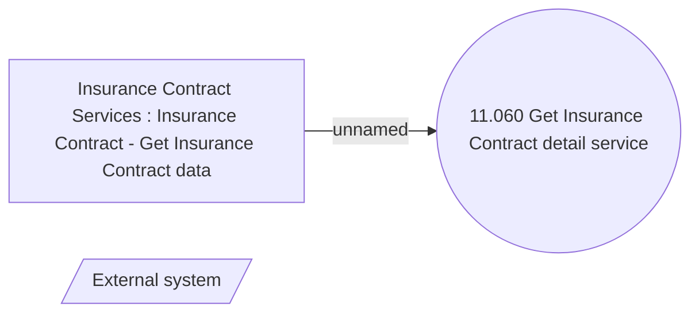

# Getting Insurance Contract data

- **Diagram Type**: Use Case
- **Package**: HomerSelect/BSL/Analysis Model/Insurance/Insurance Contract/REL Insurance features/Changing Insurance operation status/Use Case Model
- **Diagram ID**: 162065
- **Elements**: 3
- **Connectors**: 1

