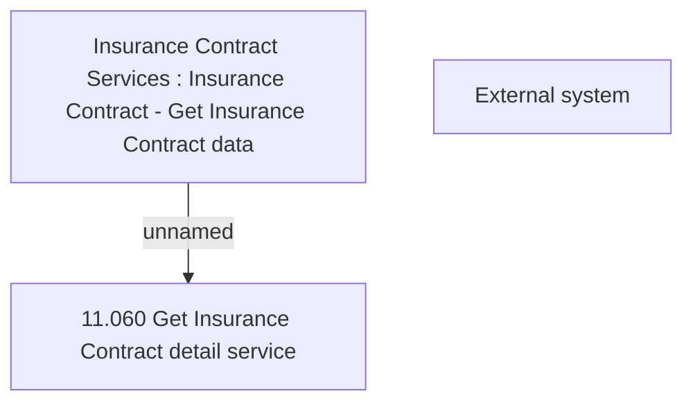

# Getting Insurance Contract data

```mermaid
graph TD
    Insurance_Contract_Services_Insurance_Contract_Get_Insurance["Insurance Contract Services : Insurance Contract - Get Insurance Contract data"]
    External_system["External system"]
    n_11_060_Get_Insurance_Contract_detail_service["11.060 Get Insurance Contract detail service"]
    Insurance_Contract_Services_Insurance_Contract_Get_Insurance -->|unnamed| n_11_060_Get_Insurance_Contract_detail_service
```
