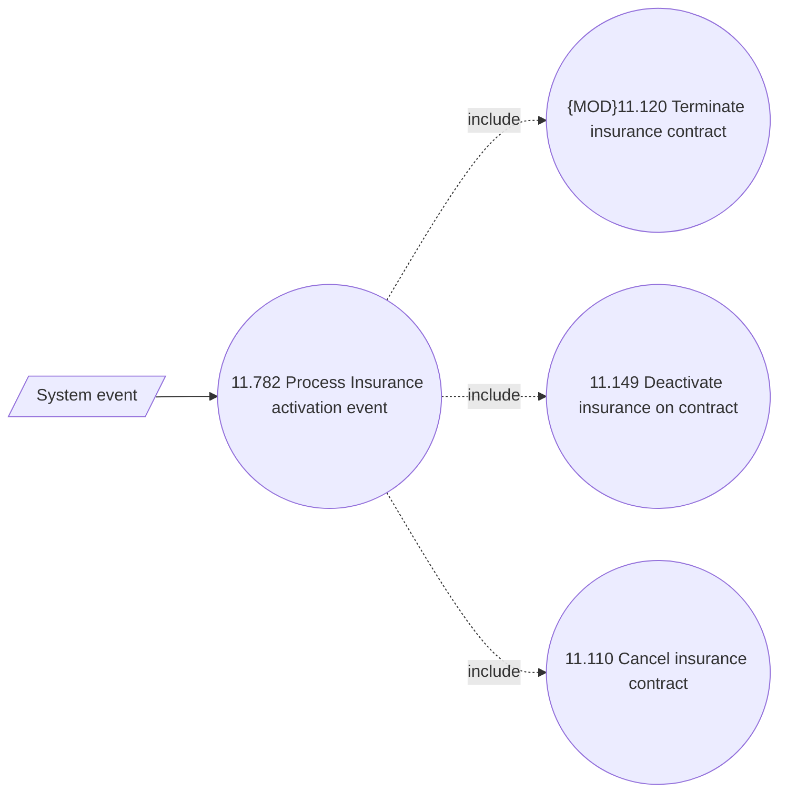

# Deactivation of mandatory insurance upon standard insurance adding

- **Diagram Type**: Use Case
- **Package**: HomerSelect/BSL/Analysis Model/Insurance/Insurance Contract/Replacement of Insurance on running contract/Use case model
- **Diagram ID**: 164353
- **Elements**: 5
- **Connectors**: 4

