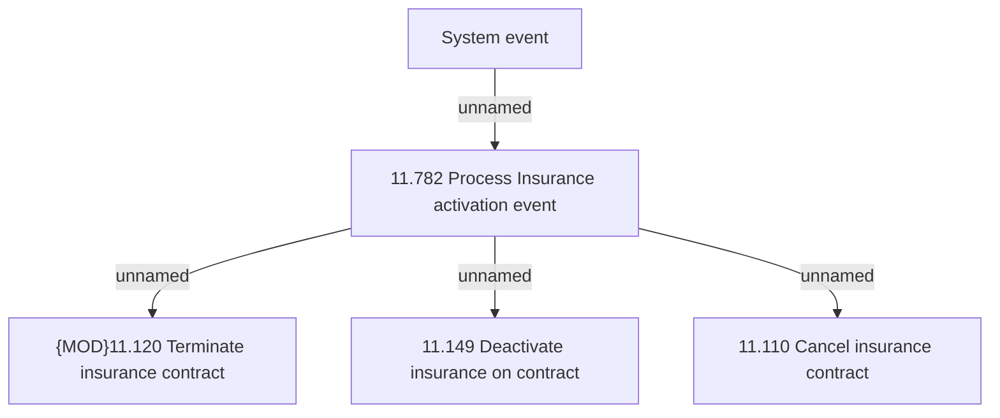

# Deactivation of mandatory insurance upon standard insurance adding

```mermaid
graph TD
    n_11_110_Cancel_insurance_contract["11.110 Cancel insurance contract"]
    MOD_11_120_Terminate_insurance_contract["{MOD}11.120 Terminate insurance contract"]
    System_event["System event"]
    n_11_782_Process_Insurance_activation_event["11.782 Process Insurance activation event"]
    n_11_149_Deactivate_insurance_on_contract["11.149 Deactivate insurance on contract"]
    n_11_782_Process_Insurance_activation_event -->|unnamed| MOD_11_120_Terminate_insurance_contract
    n_11_782_Process_Insurance_activation_event -->|unnamed| n_11_149_Deactivate_insurance_on_contract
    n_11_782_Process_Insurance_activation_event -->|unnamed| n_11_110_Cancel_insurance_contract
    System_event -->|unnamed| n_11_782_Process_Insurance_activation_event
```
