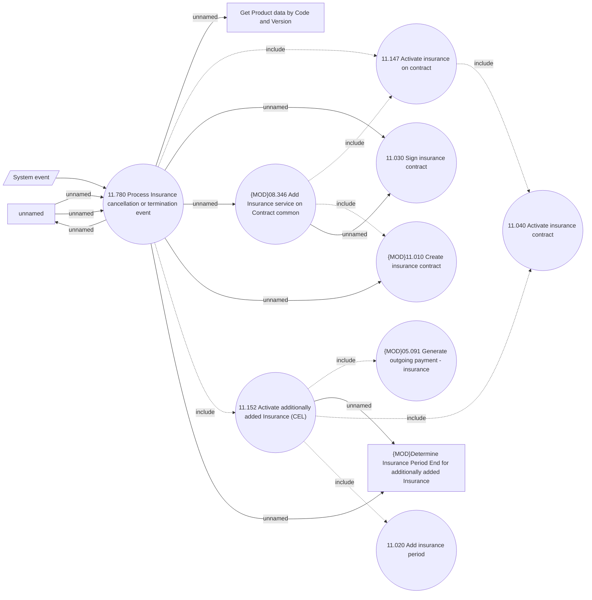

# Replacement of standard insurance upon its cancelation or termination

- **Diagram Type**: Use Case
- **Package**: HomerSelect/BSL/Analysis Model/Insurance/Insurance Contract/Replacement of Insurance on running contract/Use case model
- **Diagram ID**: 164352
- **Elements**: 15
- **Connectors**: 19

