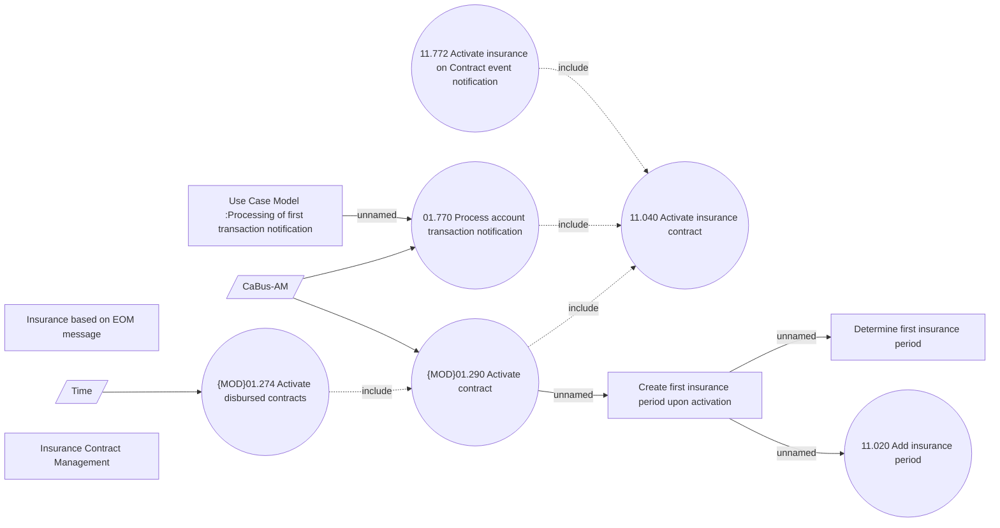

# Activate Insurance contract

- **Diagram Type**: Use Case
- **Package**: HomerSelect/BSL/Analysis Model/Insurance/Insurance Contract/Use Case Model
- **Diagram ID**: 164511
- **Elements**: 13
- **Connectors**: 11

