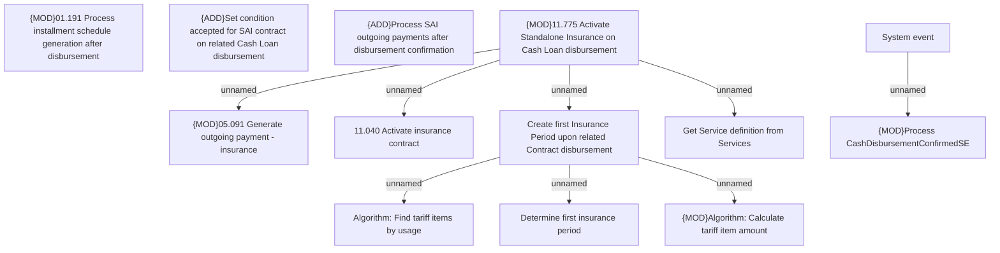

# Activate Insurance on related CL Contract disbursement

```mermaid
graph TD
    MOD_01_191_Process_installment_schedule_generation_after_dis["{MOD}01.191 Process installment schedule generation after disbursement"]
    ADD_Set_condition_accepted_for_SAI_contract_on_related_Cash_["{ADD}Set condition accepted for SAI contract on related Cash Loan disbursement"]
    ADD_Process_SAI_outgoing_payments_after_disbursement_confirm["{ADD}Process SAI outgoing payments after disbursement confirmation"]
    MOD_05_091_Generate_outgoing_payment_insurance["{MOD}05.091 Generate outgoing payment - insurance"]
    n_11_040_Activate_insurance_contract["11.040 Activate insurance contract"]
    Algorithm_Find_tariff_items_by_usage["Algorithm: Find tariff items by usage"]
    MOD_Algorithm_Calculate_tariff_item_amount["{MOD}Algorithm: Calculate tariff item amount"]
    Create_first_Insurance_Period_upon_related_Contract_disburse["Create first Insurance Period upon related Contract disbursement"]
    Determine_first_insurance_period["Determine first insurance period"]
    System_event["System event"]
    Get_Service_definition_from_Services["Get Service definition from Services"]
    MOD_11_775_Activate_Standalone_Insurance_on_Cash_Loan_disbur["{MOD}11.775 Activate Standalone Insurance on Cash Loan disbursement"]
    MOD_Process_CashDisbursementConfirmedSE["{MOD}Process CashDisbursementConfirmedSE"]
    MOD_11_775_Activate_Standalone_Insurance_on_Cash_Loan_disbur -->|unnamed| n_11_040_Activate_insurance_contract
    MOD_11_775_Activate_Standalone_Insurance_on_Cash_Loan_disbur -->|unnamed| Get_Service_definition_from_Services
    MOD_11_775_Activate_Standalone_Insurance_on_Cash_Loan_disbur -->|unnamed| Create_first_Insurance_Period_upon_related_Contract_disburse
    MOD_11_775_Activate_Standalone_Insurance_on_Cash_Loan_disbur -->|unnamed| MOD_05_091_Generate_outgoing_payment_insurance
    Create_first_Insurance_Period_upon_related_Contract_disburse -->|unnamed| Algorithm_Find_tariff_items_by_usage
    Create_first_Insurance_Period_upon_related_Contract_disburse -->|unnamed| Determine_first_insurance_period
    Create_first_Insurance_Period_upon_related_Contract_disburse -->|unnamed| MOD_Algorithm_Calculate_tariff_item_amount
    System_event -->|unnamed| MOD_Process_CashDisbursementConfirmedSE
```
