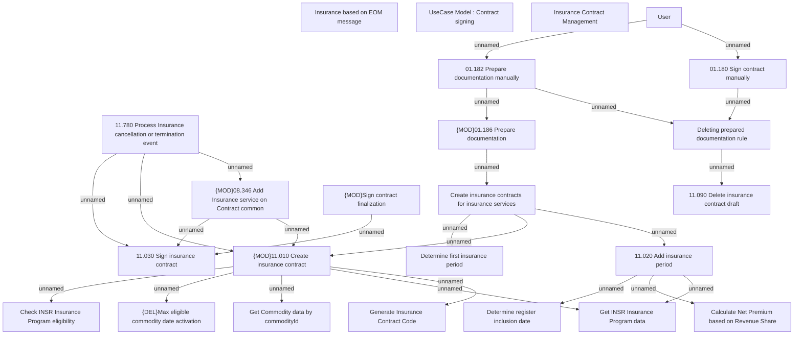

# Create and Sign Insurance contract

```mermaid
graph TD
    Insurance_based_on_EOM_message["Insurance based on EOM message"]
    Get_Commodity_data_by_commodityId["Get Commodity data by commodityId"]
    n_11_780_Process_Insurance_cancellation_or_termination_event["11.780 Process Insurance cancellation or termination event"]
    MOD_08_346_Add_Insurance_service_on_Contract_common["{MOD}08.346 Add Insurance service on Contract common"]
    Check_INSR_Insurance_Program_eligibility["Check INSR Insurance Program eligibility"]
    Get_INSR_Insurance_Program_data["Get INSR Insurance Program data"]
    DEL_Max_eligible_commodity_date_activation["{DEL}Max eligible commodity date activation"]
    MOD_01_186_Prepare_documentation["{MOD}01.186 Prepare documentation"]
    n_11_030_Sign_insurance_contract["11.030 Sign insurance contract"]
    Determine_first_insurance_period["Determine first insurance period"]
    UseCase_Model_Contract_signing["UseCase Model : Contract signing"]
    Insurance_Contract_Management["Insurance Contract Management"]
    Create_insurance_contracts_for_insurance_services["Create insurance contracts for insurance services"]
    Deleting_prepared_documentation_rule["Deleting prepared documentation rule"]
    n_11_090_Delete_insurance_contract_draft["11.090 Delete insurance contract draft"]
    Determine_register_inclusion_date["Determine register inclusion date"]
    Calculate_Net_Premium_based_on_Revenue_Share["Calculate Net Premium based on Revenue Share"]
    Generate_Insurance_Contract_Code["Generate Insurance Contract Code"]
    n_01_180_Sign_contract_manually["01.180 Sign contract manually"]
    MOD_Sign_contract_finalization["{MOD}Sign contract finalization"]
    User["User"]
    n_01_182_Prepare_documentation_manually["01.182 Prepare documentation manually"]
    n_11_020_Add_insurance_period["11.020 Add insurance period"]
    MOD_11_010_Create_insurance_contract["{MOD}11.010 Create insurance contract"]
    n_11_780_Process_Insurance_cancellation_or_termination_event -->|unnamed| MOD_08_346_Add_Insurance_service_on_Contract_common
    n_11_780_Process_Insurance_cancellation_or_termination_event -->|unnamed| MOD_11_010_Create_insurance_contract
    MOD_01_186_Prepare_documentation -->|unnamed| Create_insurance_contracts_for_insurance_services
    Create_insurance_contracts_for_insurance_services -->|unnamed| n_11_020_Add_insurance_period
    Create_insurance_contracts_for_insurance_services -->|unnamed| MOD_11_010_Create_insurance_contract
    Create_insurance_contracts_for_insurance_services -->|unnamed| Determine_first_insurance_period
    Deleting_prepared_documentation_rule -->|unnamed| n_11_090_Delete_insurance_contract_draft
    n_11_780_Process_Insurance_cancellation_or_termination_event -->|unnamed| n_11_030_Sign_insurance_contract
    MOD_Sign_contract_finalization -->|unnamed| n_11_030_Sign_insurance_contract
    MOD_11_010_Create_insurance_contract -->|unnamed| Generate_Insurance_Contract_Code
    n_01_182_Prepare_documentation_manually -->|unnamed| Deleting_prepared_documentation_rule
    n_01_182_Prepare_documentation_manually -->|unnamed| MOD_01_186_Prepare_documentation
    n_11_020_Add_insurance_period -->|unnamed| Get_INSR_Insurance_Program_data
    n_11_020_Add_insurance_period -->|unnamed| Calculate_Net_Premium_based_on_Revenue_Share
    n_11_020_Add_insurance_period -->|unnamed| Determine_register_inclusion_date
    MOD_11_010_Create_insurance_contract -->|unnamed| Get_INSR_Insurance_Program_data
    MOD_11_010_Create_insurance_contract -->|unnamed| Get_Commodity_data_by_commodityId
    MOD_11_010_Create_insurance_contract -->|unnamed| DEL_Max_eligible_commodity_date_activation
    MOD_11_010_Create_insurance_contract -->|unnamed| Check_INSR_Insurance_Program_eligibility
    n_01_180_Sign_contract_manually -->|unnamed| Deleting_prepared_documentation_rule
    MOD_08_346_Add_Insurance_service_on_Contract_common -->|unnamed| MOD_11_010_Create_insurance_contract
    MOD_08_346_Add_Insurance_service_on_Contract_common -->|unnamed| n_11_030_Sign_insurance_contract
    User -->|unnamed| n_01_180_Sign_contract_manually
    User -->|unnamed| n_01_182_Prepare_documentation_manually
```
