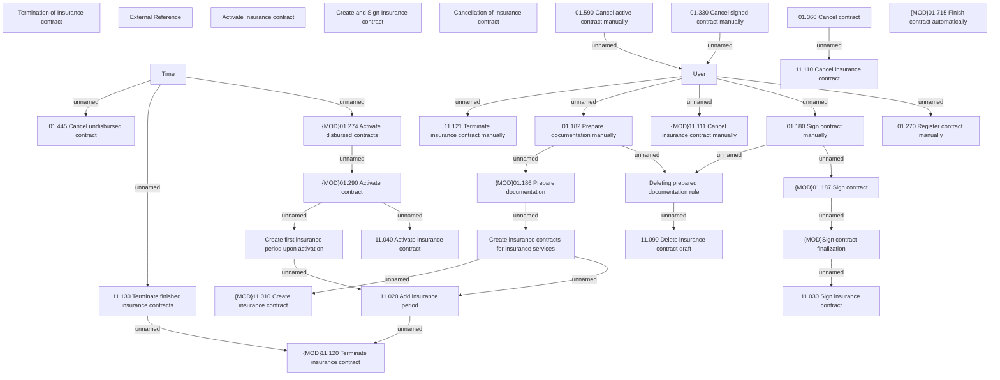

# Insurance Contract Management

```mermaid
graph TD
    Termination_of_Insurance_contract["Termination of Insurance contract "]
    Deleting_prepared_documentation_rule["Deleting prepared documentation rule"]
    n_11_121_Terminate_insurance_contract_manually["11.121 Terminate insurance contract manually"]
    MOD_01_187_Sign_contract["{MOD}01.187 Sign contract"]
    MOD_01_186_Prepare_documentation["{MOD}01.186 Prepare documentation"]
    n_11_090_Delete_insurance_contract_draft["11.090 Delete insurance contract draft"]
    External_Reference["External Reference"]
    MOD_Sign_contract_finalization["{MOD}Sign contract finalization"]
    MOD_11_111_Cancel_insurance_contract_manually["{MOD}11.111 Cancel insurance contract manually"]
    Activate_Insurance_contract["Activate Insurance contract"]
    Create_and_Sign_Insurance_contract["Create and Sign Insurance contract"]
    Cancellation_of_Insurance_contract["Cancellation of Insurance contract"]
    Create_insurance_contracts_for_insurance_services["Create insurance contracts for insurance services"]
    n_01_445_Cancel_undisbursed_contract["01.445 Cancel undisbursed contract"]
    n_01_330_Cancel_signed_contract_manually["01.330 Cancel signed contract manually"]
    n_01_590_Cancel_active_contract_manually["01.590 Cancel active contract manually"]
    Create_first_insurance_period_upon_activation["Create first insurance period upon activation"]
    n_11_130_Terminate_finished_insurance_contracts["11.130 Terminate finished insurance contracts"]
    n_01_360_Cancel_contract["01.360 Cancel contract"]
    Time["Time"]
    MOD_01_274_Activate_disbursed_contracts["{MOD}01.274 Activate disbursed contracts"]
    MOD_01_290_Activate_contract["{MOD}01.290 Activate contract"]
    n_01_270_Register_contract_manually["01.270 Register contract manually"]
    n_01_180_Sign_contract_manually["01.180 Sign contract manually"]
    User["User"]
    n_01_182_Prepare_documentation_manually["01.182 Prepare documentation manually"]
    n_11_040_Activate_insurance_contract["11.040 Activate insurance contract"]
    n_11_030_Sign_insurance_contract["11.030 Sign insurance contract"]
    MOD_11_120_Terminate_insurance_contract["{MOD}11.120 Terminate insurance contract"]
    n_11_110_Cancel_insurance_contract["11.110 Cancel insurance contract"]
    n_11_020_Add_insurance_period["11.020 Add insurance period"]
    MOD_11_010_Create_insurance_contract["{MOD}11.010 Create insurance contract"]
    MOD_01_715_Finish_contract_automatically["{MOD}01.715 Finish contract automatically"]
    MOD_01_274_Activate_disbursed_contracts -->|unnamed| MOD_01_290_Activate_contract
    MOD_01_187_Sign_contract -->|unnamed| MOD_Sign_contract_finalization
    MOD_01_186_Prepare_documentation -->|unnamed| Create_insurance_contracts_for_insurance_services
    MOD_Sign_contract_finalization -->|unnamed| n_11_030_Sign_insurance_contract
    Create_insurance_contracts_for_insurance_services -->|unnamed| n_11_020_Add_insurance_period
    Create_insurance_contracts_for_insurance_services -->|unnamed| MOD_11_010_Create_insurance_contract
    n_01_330_Cancel_signed_contract_manually -->|unnamed| User
    n_01_590_Cancel_active_contract_manually -->|unnamed| User
    Create_first_insurance_period_upon_activation -->|unnamed| n_11_020_Add_insurance_period
    n_11_130_Terminate_finished_insurance_contracts -->|unnamed| MOD_11_120_Terminate_insurance_contract
    n_01_360_Cancel_contract -->|unnamed| n_11_110_Cancel_insurance_contract
    Deleting_prepared_documentation_rule -->|unnamed| n_11_090_Delete_insurance_contract_draft
    MOD_01_290_Activate_contract -->|unnamed| n_11_040_Activate_insurance_contract
    MOD_01_290_Activate_contract -->|unnamed| Create_first_insurance_period_upon_activation
    n_01_180_Sign_contract_manually -->|unnamed| MOD_01_187_Sign_contract
    n_01_180_Sign_contract_manually -->|unnamed| Deleting_prepared_documentation_rule
    n_01_182_Prepare_documentation_manually -->|unnamed| Deleting_prepared_documentation_rule
    n_01_182_Prepare_documentation_manually -->|unnamed| MOD_01_186_Prepare_documentation
    n_11_020_Add_insurance_period -->|unnamed| MOD_11_120_Terminate_insurance_contract
    User -->|unnamed| n_01_270_Register_contract_manually
    User -->|unnamed| n_01_180_Sign_contract_manually
    User -->|unnamed| MOD_11_111_Cancel_insurance_contract_manually
    User -->|unnamed| n_01_182_Prepare_documentation_manually
    User -->|unnamed| n_11_121_Terminate_insurance_contract_manually
    Time -->|unnamed| MOD_01_274_Activate_disbursed_contracts
    Time -->|unnamed| n_11_130_Terminate_finished_insurance_contracts
    Time -->|unnamed| n_01_445_Cancel_undisbursed_contract
```
