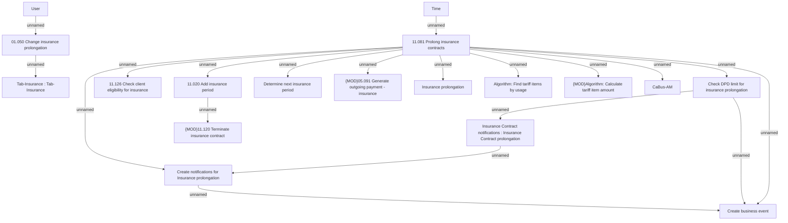

# Insurance prolongation

```mermaid
graph TD
    Tab_Insurance_Tab_Insurance["Tab-Insurance : Tab-Insurance"]
    n_01_050_Change_insurance_prolongation["01.050 Change insurance prolongation"]
    User["User"]
    Insurance_Contract_notifications_Insurance_Contract_prolonga["Insurance Contract notifications : Insurance Contract prolongation"]
    Create_notifications_for_Insurance_prolongation["Create notifications for Insurance prolongation"]
    Create_business_event["Create business event"]
    Check_DPD_limit_for_insurance_prolongation["Check DPD limit for insurance prolongation"]
    n_11_126_Check_client_eligibility_for_insurance["11.126 Check client eligibility for insurance"]
    n_11_020_Add_insurance_period["11.020 Add insurance period"]
    Determine_next_insurance_period["Determine next insurance period"]
    MOD_05_091_Generate_outgoing_payment_insurance["{MOD}05.091 Generate outgoing payment - insurance"]
    MOD_11_120_Terminate_insurance_contract["{MOD}11.120 Terminate insurance contract"]
    n_11_081_Prolong_insurance_contracts["11.081 Prolong insurance contracts"]
    Insurance_prolongation["Insurance prolongation"]
    Algorithm_Find_tariff_items_by_usage["Algorithm: Find tariff items by usage"]
    MOD_Algorithm_Calculate_tariff_item_amount["{MOD}Algorithm: Calculate tariff item amount"]
    CaBus_AM["CaBus-AM"]
    Time["Time"]
    n_11_081_Prolong_insurance_contracts -->|unnamed| Create_notifications_for_Insurance_prolongation
    Insurance_Contract_notifications_Insurance_Contract_prolonga -->|unnamed| Create_notifications_for_Insurance_prolongation
    Create_notifications_for_Insurance_prolongation -->|unnamed| Create_business_event
    Check_DPD_limit_for_insurance_prolongation -->|unnamed| Insurance_Contract_notifications_Insurance_Contract_prolonga
    Check_DPD_limit_for_insurance_prolongation -->|unnamed| Create_business_event
    n_11_020_Add_insurance_period -->|unnamed| MOD_11_120_Terminate_insurance_contract
    n_11_081_Prolong_insurance_contracts -->|unnamed| Check_DPD_limit_for_insurance_prolongation
    n_01_050_Change_insurance_prolongation -->|unnamed| Tab_Insurance_Tab_Insurance
    n_11_081_Prolong_insurance_contracts -->|unnamed| CaBus_AM
    n_11_081_Prolong_insurance_contracts -->|unnamed| Create_business_event
    n_11_081_Prolong_insurance_contracts -->|unnamed| MOD_05_091_Generate_outgoing_payment_insurance
    n_11_081_Prolong_insurance_contracts -->|unnamed| Algorithm_Find_tariff_items_by_usage
    n_11_081_Prolong_insurance_contracts -->|unnamed| MOD_Algorithm_Calculate_tariff_item_amount
    n_11_081_Prolong_insurance_contracts -->|unnamed| Insurance_prolongation
    n_11_081_Prolong_insurance_contracts -->|unnamed| n_11_126_Check_client_eligibility_for_insurance
    n_11_081_Prolong_insurance_contracts -->|unnamed| n_11_020_Add_insurance_period
    n_11_081_Prolong_insurance_contracts -->|unnamed| Determine_next_insurance_period
    User -->|unnamed| n_01_050_Change_insurance_prolongation
    Time -->|unnamed| n_11_081_Prolong_insurance_contracts
```
