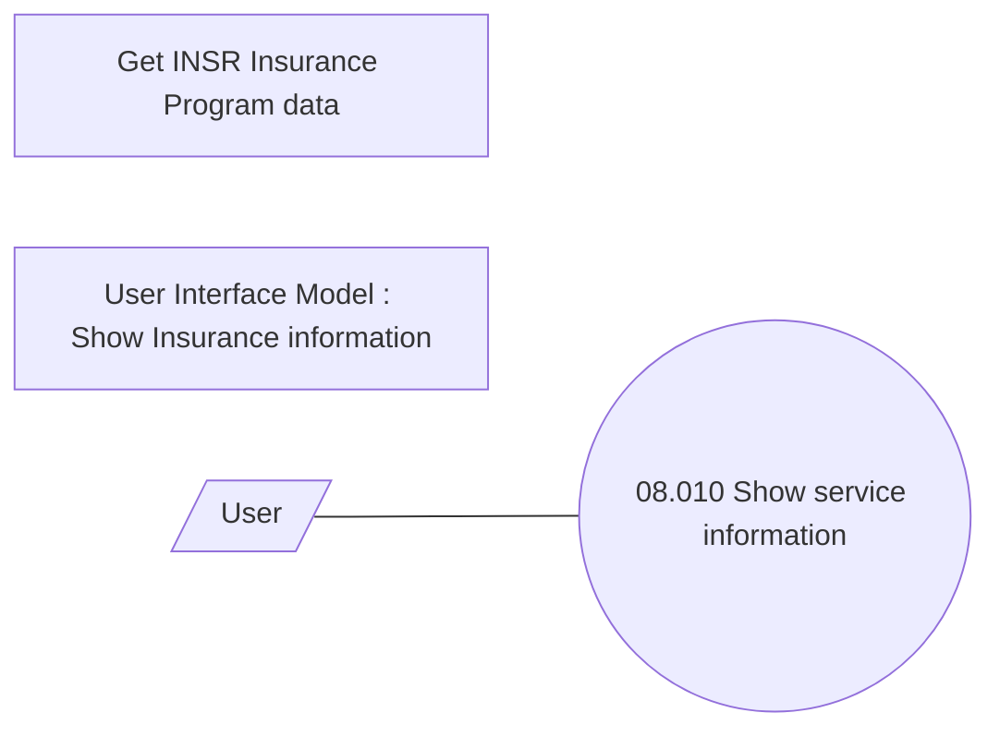

# Showing Insurance Contract info

- **Diagram Type**: Use Case
- **Package**: HomerSelect/BSL/Analysis Model/Insurance/Insurance Contract/Use Case Model
- **Diagram ID**: 164513
- **Elements**: 4
- **Connectors**: 1

