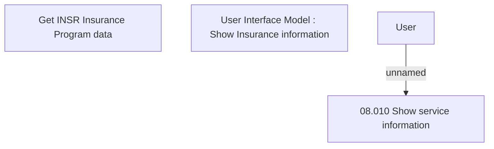

# Showing Insurance Contract info

```mermaid
graph TD
    Get_INSR_Insurance_Program_data["Get INSR Insurance Program data"]
    User_Interface_Model_Show_Insurance_information["User Interface Model : Show Insurance information"]
    User["User"]
    n_08_010_Show_service_information["08.010 Show service information"]
    User -->|unnamed| n_08_010_Show_service_information
```
