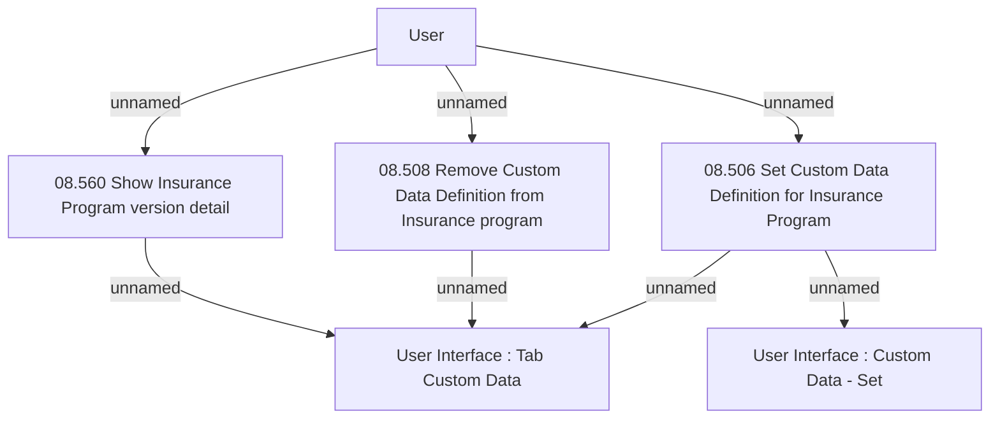

# Set Custom Data Item

```mermaid
graph TD
    User_Interface_Custom_Data_Set["User Interface : Custom Data - Set"]
    User_Interface_Tab_Custom_Data["User Interface : Tab Custom Data"]
    n_08_508_Remove_Custom_Data_Definition_from_Insurance_progra["08.508 Remove Custom Data Definition from Insurance program"]
    n_08_560_Show_Insurance_Program_version_detail["08.560 Show Insurance Program version detail"]
    n_08_506_Set_Custom_Data_Definition_for_Insurance_Program["08.506 Set Custom Data Definition for Insurance Program"]
    User["User"]
    n_08_506_Set_Custom_Data_Definition_for_Insurance_Program -->|unnamed| User_Interface_Custom_Data_Set
    n_08_506_Set_Custom_Data_Definition_for_Insurance_Program -->|unnamed| User_Interface_Tab_Custom_Data
    n_08_508_Remove_Custom_Data_Definition_from_Insurance_progra -->|unnamed| User_Interface_Tab_Custom_Data
    User -->|unnamed| n_08_508_Remove_Custom_Data_Definition_from_Insurance_progra
    User -->|unnamed| n_08_560_Show_Insurance_Program_version_detail
    User -->|unnamed| n_08_506_Set_Custom_Data_Definition_for_Insurance_Program
    n_08_560_Show_Insurance_Program_version_detail -->|unnamed| User_Interface_Tab_Custom_Data
```
