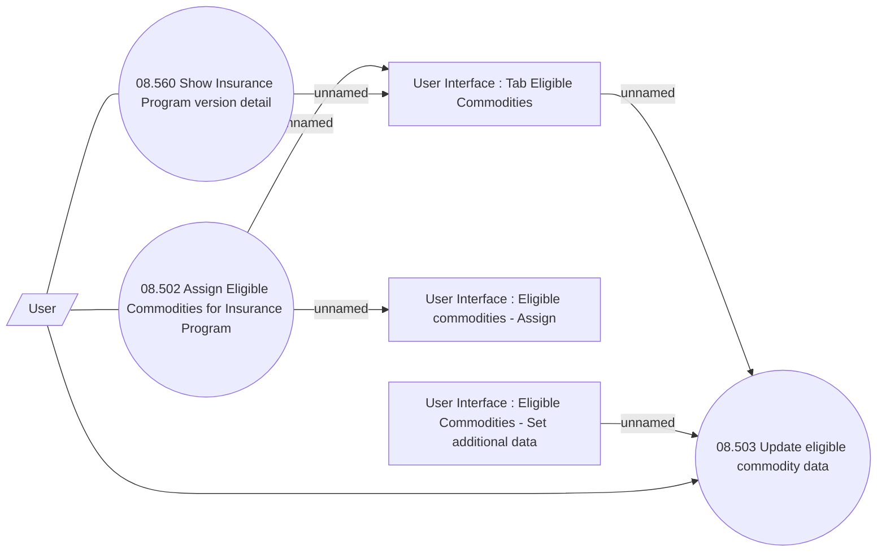

# Assign & Update Eligible Commodities

- **Diagram Type**: Use Case
- **Package**: HomerSelect/BSL/Analysis Model/Insurance/Insurance Program - old BSL/Eligible Commodities/Use Case
- **Diagram ID**: 125300
- **Elements**: 7
- **Connectors**: 8

