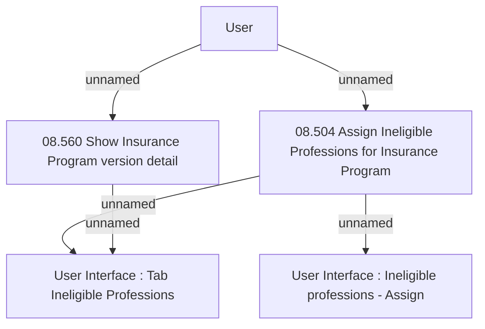

# Assign Ineligible Professions

```mermaid
graph TD
    User_Interface_Ineligible_professions_Assign["User Interface : Ineligible professions - Assign"]
    User_Interface_Tab_Ineligible_Professions["User Interface : Tab Ineligible Professions"]
    n_08_560_Show_Insurance_Program_version_detail["08.560 Show Insurance Program version detail"]
    n_08_504_Assign_Ineligible_Professions_for_Insurance_Program["08.504 Assign Ineligible Professions for Insurance Program"]
    User["User"]
    n_08_504_Assign_Ineligible_Professions_for_Insurance_Program -->|unnamed| User_Interface_Ineligible_professions_Assign
    n_08_504_Assign_Ineligible_Professions_for_Insurance_Program -->|unnamed| User_Interface_Tab_Ineligible_Professions
    User -->|unnamed| n_08_560_Show_Insurance_Program_version_detail
    User -->|unnamed| n_08_504_Assign_Ineligible_Professions_for_Insurance_Program
    n_08_560_Show_Insurance_Program_version_detail -->|unnamed| User_Interface_Tab_Ineligible_Professions
```
