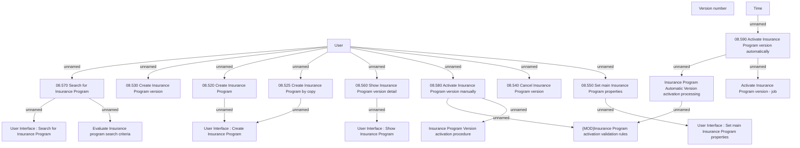

# Manage Insurance Program

```mermaid
graph TD
    Insurance_Program_Version_activation_procedure["Insurance Program Version activation procedure"]
    Insurance_Program_Automatic_Version_activation_processing["Insurance Program Automatic Version activation processing"]
    MOD_Insurance_Program_activation_validation_rules["{MOD}Insurance Program activation validation rules"]
    Activate_Insurance_Program_version_job["Activate Insurance Program version - job"]
    User_Interface_Search_for_Insurance_Program["User Interface : Search for Insurance Program"]
    Evaluate_Insurance_program_search_criteria["Evaluate Insurance program search criteria"]
    User_Interface_Show_Insurance_Program["User Interface : Show Insurance Program"]
    User_Interface_Set_main_Insurance_Program_properties["User Interface : Set main Insurance Program properties"]
    User_Interface_Create_Insurance_Program["User Interface : Create Insurance Program"]
    Version_number["Version number"]
    Time["Time"]
    User["User"]
    n_08_590_Activate_Insurance_Program_version_automatically["08.590 Activate Insurance Program version automatically"]
    n_08_580_Activate_Insurance_Program_version_manually["08.580 Activate Insurance Program version manually"]
    n_08_570_Search_for_Insurance_Program["08.570 Search for Insurance Program"]
    n_08_550_Set_main_Insurance_Program_properties["08.550 Set main Insurance Program properties"]
    n_08_540_Cancel_Insurance_Program_version["08.540 Cancel Insurance Program version"]
    n_08_530_Create_Insurance_Program_version["08.530 Create Insurance Program version"]
    n_08_525_Create_Insurance_Program_by_copy["08.525 Create Insurance Program by copy"]
    n_08_520_Create_Insurance_Program["08.520 Create Insurance Program"]
    n_08_560_Show_Insurance_Program_version_detail["08.560 Show Insurance Program version detail"]
    n_08_525_Create_Insurance_Program_by_copy -->|unnamed| User_Interface_Create_Insurance_Program
    n_08_590_Activate_Insurance_Program_version_automatically -->|unnamed| Insurance_Program_Automatic_Version_activation_processing
    Insurance_Program_Automatic_Version_activation_processing -->|unnamed| MOD_Insurance_Program_activation_validation_rules
    n_08_580_Activate_Insurance_Program_version_manually -->|unnamed| MOD_Insurance_Program_activation_validation_rules
    n_08_590_Activate_Insurance_Program_version_automatically -->|unnamed| Activate_Insurance_Program_version_job
    n_08_570_Search_for_Insurance_Program -->|unnamed| User_Interface_Search_for_Insurance_Program
    n_08_570_Search_for_Insurance_Program -->|unnamed| Evaluate_Insurance_program_search_criteria
    n_08_560_Show_Insurance_Program_version_detail -->|unnamed| User_Interface_Show_Insurance_Program
    n_08_580_Activate_Insurance_Program_version_manually -->|unnamed| Insurance_Program_Version_activation_procedure
    n_08_520_Create_Insurance_Program -->|unnamed| User_Interface_Create_Insurance_Program
    n_08_550_Set_main_Insurance_Program_properties -->|unnamed| User_Interface_Set_main_Insurance_Program_properties
    Time -->|unnamed| n_08_590_Activate_Insurance_Program_version_automatically
    User -->|unnamed| n_08_570_Search_for_Insurance_Program
    User -->|unnamed| n_08_530_Create_Insurance_Program_version
    User -->|unnamed| n_08_520_Create_Insurance_Program
    User -->|unnamed| n_08_525_Create_Insurance_Program_by_copy
    User -->|unnamed| n_08_560_Show_Insurance_Program_version_detail
    User -->|unnamed| n_08_580_Activate_Insurance_Program_version_manually
    User -->|unnamed| n_08_540_Cancel_Insurance_Program_version
    User -->|unnamed| n_08_550_Set_main_Insurance_Program_properties
```
