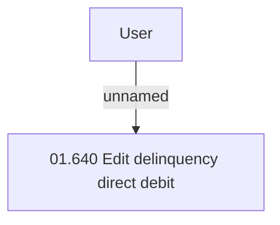

# Use Case Model

```mermaid
graph TD
    User["User"]
    n_01_640_Edit_delinquency_direct_debit["01.640 Edit delinquency direct debit"]
    User -->|unnamed| n_01_640_Edit_delinquency_direct_debit
```
