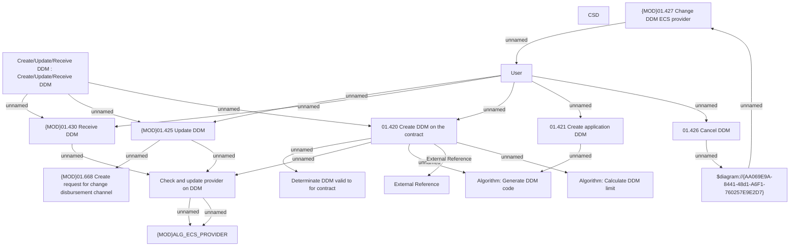

# Create/Update/Receive DDM

```mermaid
graph TD
    CSD["CSD"]
    n_01_421_Create_application_DDM["01.421 Create application DDM"]
    External_Reference["External Reference"]
    Check_and_update_provider_on_DDM["Check and update provider on DDM"]
    Determinate_DDM_valid_to_for_contract["Determinate DDM valid to for contract"]
    MOD_01_427_Change_DDM_ECS_provider["{MOD}01.427 Change DDM ECS provider"]
    MOD_01_668_Create_request_for_change_disbursement_channel["{MOD}01.668 Create request for change disbursement channel"]
    diagram_AA069E9A_8441_48d1_A6F1_760257E9E2D7["$diagram://{AA069E9A-8441-48d1-A6F1-760257E9E2D7}"]
    n_01_420_Create_DDM_on_the_contract["01.420 Create DDM on the contract"]
    n_01_426_Cancel_DDM["01.426 Cancel DDM"]
    Algorithm_Generate_DDM_code["Algorithm: Generate DDM code"]
    Algorithm_Calculate_DDM_limit["Algorithm: Calculate DDM limit"]
    MOD_ALG_ECS_PROVIDER["{MOD}ALG_ECS_PROVIDER"]
    Create_Update_Receive_DDM_Create_Update_Receive_DDM["Create/Update/Receive DDM : Create/Update/Receive DDM"]
    User["User"]
    MOD_01_430_Receive_DDM["{MOD}01.430 Receive DDM"]
    MOD_01_425_Update_DDM["{MOD}01.425 Update DDM"]
    n_01_426_Cancel_DDM -->|unnamed| diagram_AA069E9A_8441_48d1_A6F1_760257E9E2D7
    n_01_421_Create_application_DDM -->|unnamed| Algorithm_Generate_DDM_code
    MOD_01_427_Change_DDM_ECS_provider -->|unnamed| User
    diagram_AA069E9A_8441_48d1_A6F1_760257E9E2D7 -->|unnamed| MOD_01_427_Change_DDM_ECS_provider
    n_01_420_Create_DDM_on_the_contract -->|unnamed| Determinate_DDM_valid_to_for_contract
    n_01_420_Create_DDM_on_the_contract -->|unnamed| Check_and_update_provider_on_DDM
    n_01_420_Create_DDM_on_the_contract -->|unnamed| Algorithm_Generate_DDM_code
    n_01_420_Create_DDM_on_the_contract -->|External Reference| External_Reference
    MOD_01_425_Update_DDM -->|unnamed| MOD_01_668_Create_request_for_change_disbursement_channel
    Create_Update_Receive_DDM_Create_Update_Receive_DDM -->|unnamed| MOD_01_430_Receive_DDM
    Create_Update_Receive_DDM_Create_Update_Receive_DDM -->|unnamed| MOD_01_425_Update_DDM
    Create_Update_Receive_DDM_Create_Update_Receive_DDM -->|unnamed| n_01_420_Create_DDM_on_the_contract
    MOD_01_430_Receive_DDM -->|unnamed| Check_and_update_provider_on_DDM
    MOD_01_425_Update_DDM -->|unnamed| Check_and_update_provider_on_DDM
    n_01_420_Create_DDM_on_the_contract -->|unnamed| Algorithm_Calculate_DDM_limit
    User -->|unnamed| MOD_01_425_Update_DDM
    User -->|unnamed| MOD_01_430_Receive_DDM
    User -->|unnamed| n_01_420_Create_DDM_on_the_contract
    User -->|unnamed| n_01_421_Create_application_DDM
    User -->|unnamed| n_01_426_Cancel_DDM
    Check_and_update_provider_on_DDM -->|unnamed| MOD_ALG_ECS_PROVIDER
    Check_and_update_provider_on_DDM -->|unnamed| MOD_ALG_ECS_PROVIDER
```
