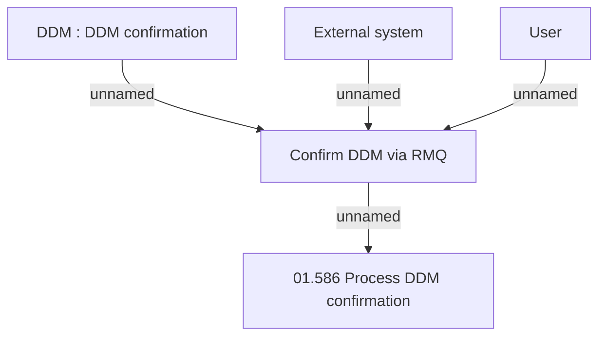

# DDM confirmation via RMQ

```mermaid
graph TD
    DDM_DDM_confirmation["DDM : DDM confirmation"]
    n_01_586_Process_DDM_confirmation["01.586 Process DDM confirmation "]
    External_system["External system"]
    User["User"]
    Confirm_DDM_via_RMQ["Confirm DDM via RMQ"]
    DDM_DDM_confirmation -->|unnamed| Confirm_DDM_via_RMQ
    Confirm_DDM_via_RMQ -->|unnamed| n_01_586_Process_DDM_confirmation
    External_system -->|unnamed| Confirm_DDM_via_RMQ
    User -->|unnamed| Confirm_DDM_via_RMQ
```
