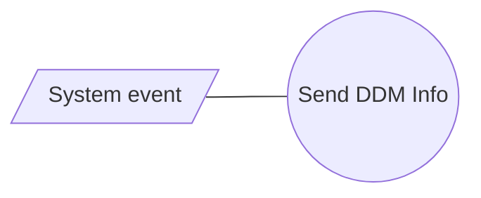

# DDM Info

- **Diagram Type**: Use Case
- **Package**: HomerSelect/BSL/Analysis Model/Payments/Direct Debit Mandate (DDM)/DDM info/UseCase Model
- **Diagram ID**: 162504
- **Elements**: 2
- **Connectors**: 1

