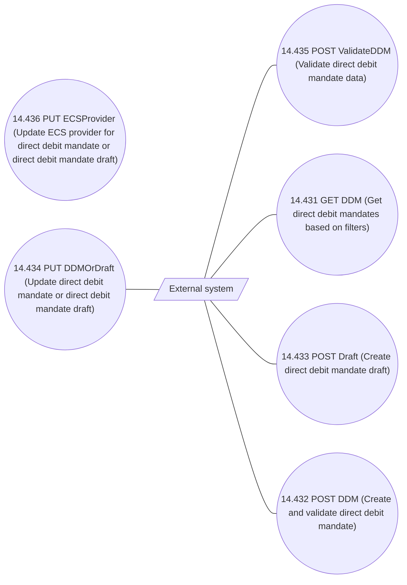

# DDM processing via REST API - UseCase Model

- **Diagram Type**: Use Case
- **Package**: HomerSelect/BSL/Analysis Model/Payments/Direct Debit Mandate (DDM)/DDM processing via REST API/UseCase Model
- **Diagram ID**: 158056
- **Elements**: 7
- **Connectors**: 5

