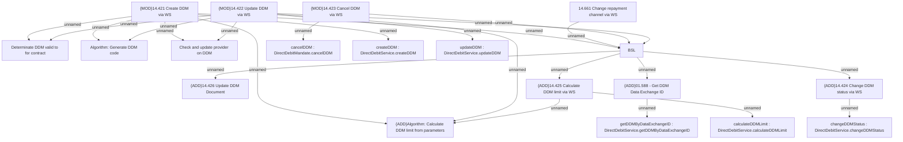

# DDM via WS

```mermaid
graph TD
    ADD_14_426_Update_DDM_Document["{ADD}14.426 Update DDM Document"]
    getDDMByDataExchangeID_DirectDebitService_getDDMByDataExchan["getDDMByDataExchangeID : DirectDebitService.getDDMByDataExchangeID"]
    ADD_01_588_Get_DDM_Data_Exchange_ID["{ADD}01.588 - Get DDM Data Exchange ID"]
    calculateDDMLimit_DirectDebitService_calculateDDMLimit["calculateDDMLimit : DirectDebitService.calculateDDMLimit"]
    ADD_14_425_Calculate_DDM_limit_via_WS["{ADD}14.425 Calculate DDM limit via WS"]
    changeDDMStatus_DirectDebitService_changeDDMStatus["changeDDMStatus : DirectDebitService.changeDDMStatus"]
    Determinate_DDM_valid_to_for_contract["Determinate DDM valid to for contract"]
    Algorithm_Generate_DDM_code["Algorithm: Generate DDM code"]
    ADD_Algorithm_Calculate_DDM_limit_from_parameters["{ADD}Algorithm: Calculate DDM limit from parameters"]
    ADD_14_424_Change_DDM_status_via_WS["{ADD}14.424 Change DDM status via WS"]
    Check_and_update_provider_on_DDM["Check and update provider on DDM"]
    BSL["BSL"]
    cancelDDM_DirectDebitMandate_cancelDDM["cancelDDM : DirectDebitMandate.cancelDDM"]
    createDDM_DirectDebitService_createDDM["createDDM : DirectDebitService.createDDM"]
    updateDDM_DirectDebitService_updateDDM["updateDDM : DirectDebitService.updateDDM"]
    MOD_14_423_Cancel_DDM_via_WS["{MOD}14.423 Cancel DDM via WS"]
    MOD_14_422_Update_DDM_via_WS["{MOD}14.422 Update DDM via WS"]
    MOD_14_421_Create_DDM_via_WS["{MOD}14.421 Create DDM via WS"]
    n_14_661_Change_repayment_channel_via_WS["14.661 Change repayment channel via WS"]
    BSL -->|unnamed| ADD_01_588_Get_DDM_Data_Exchange_ID
    BSL -->|unnamed| ADD_14_425_Calculate_DDM_limit_via_WS
    BSL -->|unnamed| ADD_14_426_Update_DDM_Document
    BSL -->|unnamed| ADD_14_424_Change_DDM_status_via_WS
    MOD_14_422_Update_DDM_via_WS -->|unnamed| BSL
    ADD_14_425_Calculate_DDM_limit_via_WS -->|unnamed| calculateDDMLimit_DirectDebitService_calculateDDMLimit
    ADD_14_425_Calculate_DDM_limit_via_WS -->|unnamed| ADD_Algorithm_Calculate_DDM_limit_from_parameters
    ADD_14_424_Change_DDM_status_via_WS -->|unnamed| changeDDMStatus_DirectDebitService_changeDDMStatus
    MOD_14_423_Cancel_DDM_via_WS -->|unnamed| cancelDDM_DirectDebitMandate_cancelDDM
    MOD_14_423_Cancel_DDM_via_WS -->|unnamed| BSL
    ADD_01_588_Get_DDM_Data_Exchange_ID -->|unnamed| getDDMByDataExchangeID_DirectDebitService_getDDMByDataExchan
    MOD_14_422_Update_DDM_via_WS -->|unnamed| ADD_Algorithm_Calculate_DDM_limit_from_parameters
    n_14_661_Change_repayment_channel_via_WS -->|unnamed| BSL
    MOD_14_422_Update_DDM_via_WS -->|unnamed| Algorithm_Generate_DDM_code
    MOD_14_422_Update_DDM_via_WS -->|unnamed| Determinate_DDM_valid_to_for_contract
    MOD_14_422_Update_DDM_via_WS -->|unnamed| Check_and_update_provider_on_DDM
    MOD_14_421_Create_DDM_via_WS -->|unnamed| createDDM_DirectDebitService_createDDM
    MOD_14_421_Create_DDM_via_WS -->|unnamed| ADD_Algorithm_Calculate_DDM_limit_from_parameters
    MOD_14_421_Create_DDM_via_WS -->|unnamed| Check_and_update_provider_on_DDM
    MOD_14_421_Create_DDM_via_WS -->|unnamed| BSL
    MOD_14_421_Create_DDM_via_WS -->|unnamed| Determinate_DDM_valid_to_for_contract
    MOD_14_421_Create_DDM_via_WS -->|unnamed| Algorithm_Generate_DDM_code
    MOD_14_422_Update_DDM_via_WS -->|unnamed| updateDDM_DirectDebitService_updateDDM
```
