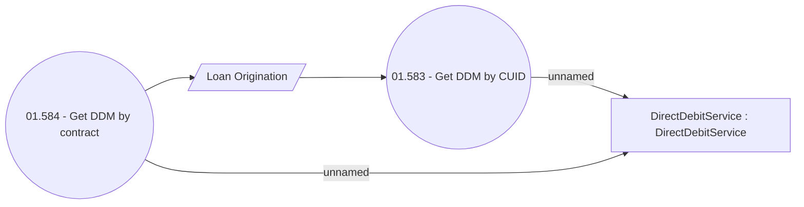

# Get DDM info

- **Diagram Type**: Use Case
- **Package**: HomerSelect/BSL/Analysis Model/Payments/Direct Debit Mandate (DDM)/DDM via WS/Use Case Model
- **Diagram ID**: 162684
- **Elements**: 4
- **Connectors**: 4

