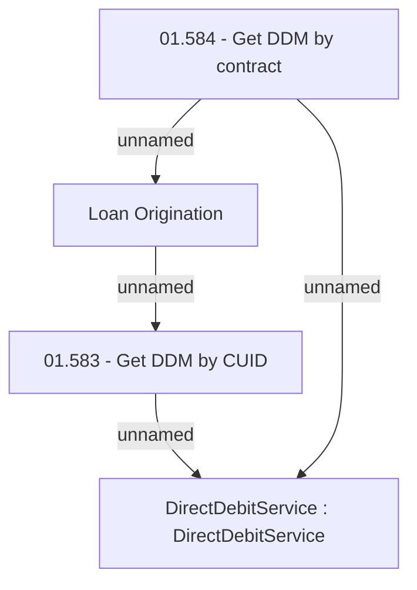

# Get DDM info

```mermaid
graph TD
    n_01_584_Get_DDM_by_contract["01.584 - Get DDM by contract"]
    DirectDebitService_DirectDebitService["DirectDebitService : DirectDebitService"]
    Loan_Origination["Loan Origination"]
    n_01_583_Get_DDM_by_CUID["01.583 - Get DDM by CUID"]
    n_01_583_Get_DDM_by_CUID -->|unnamed| DirectDebitService_DirectDebitService
    n_01_584_Get_DDM_by_contract -->|unnamed| Loan_Origination
    n_01_584_Get_DDM_by_contract -->|unnamed| DirectDebitService_DirectDebitService
    Loan_Origination -->|unnamed| n_01_583_Get_DDM_by_CUID
```
