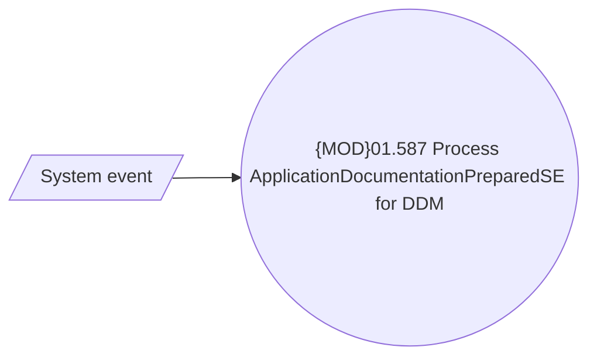

# Process internal system events and notifications for DDMs

- **Diagram Type**: Use Case
- **Package**: HomerSelect/BSL/Analysis Model/Payments/Direct Debit Mandate (DDM)/Process internal system events and notifications for DDMs/UseCase model
- **Diagram ID**: 130265
- **Elements**: 2
- **Connectors**: 1

