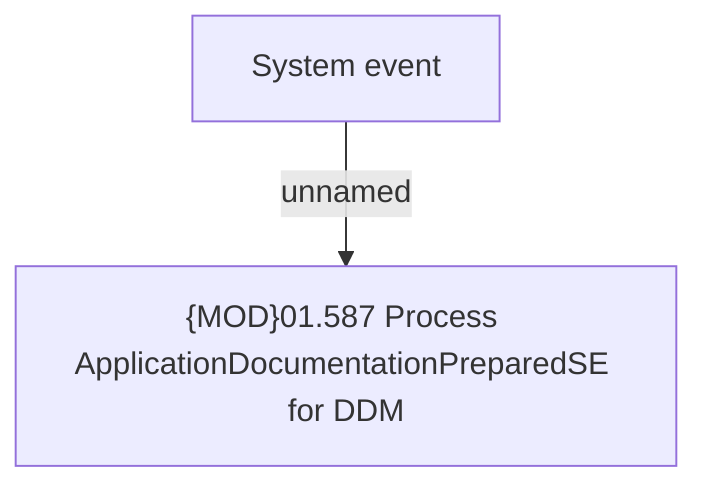

# Process internal system events and notifications for DDMs

```mermaid
graph TD
    System_event["System event"]
    MOD_01_587_Process_ApplicationDocumentationPreparedSE_for_DD["{MOD}01.587 Process ApplicationDocumentationPreparedSE for DDM"]
    System_event -->|unnamed| MOD_01_587_Process_ApplicationDocumentationPreparedSE_for_DD
```
