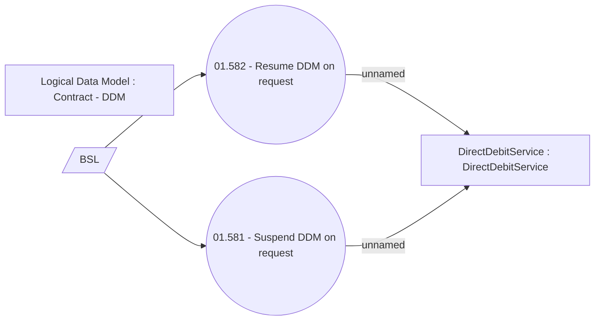

# Suspend and resume DDM

- **Diagram Type**: Use Case
- **Package**: HomerSelect/BSL/Analysis Model/Payments/Direct Debit Mandate (DDM)/Suspend and resume DDM/UseCase Model
- **Diagram ID**: 109675
- **Elements**: 5
- **Connectors**: 4

