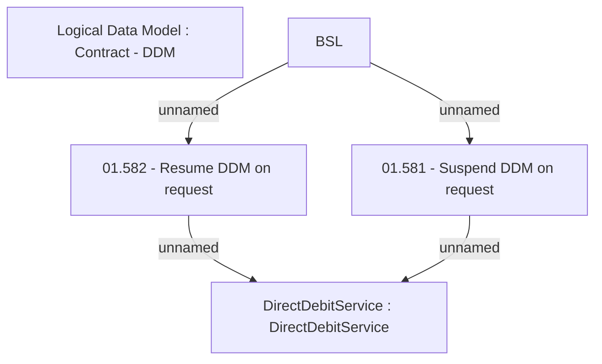

# Suspend and resume DDM

```mermaid
graph TD
    Logical_Data_Model_Contract_DDM["Logical Data Model : Contract - DDM"]
    DirectDebitService_DirectDebitService["DirectDebitService : DirectDebitService"]
    n_01_581_Suspend_DDM_on_request["01.581 - Suspend DDM on request"]
    n_01_582_Resume_DDM_on_request["01.582 - Resume DDM on request"]
    BSL["BSL"]
    n_01_582_Resume_DDM_on_request -->|unnamed| DirectDebitService_DirectDebitService
    n_01_581_Suspend_DDM_on_request -->|unnamed| DirectDebitService_DirectDebitService
    BSL -->|unnamed| n_01_581_Suspend_DDM_on_request
    BSL -->|unnamed| n_01_582_Resume_DDM_on_request
```
