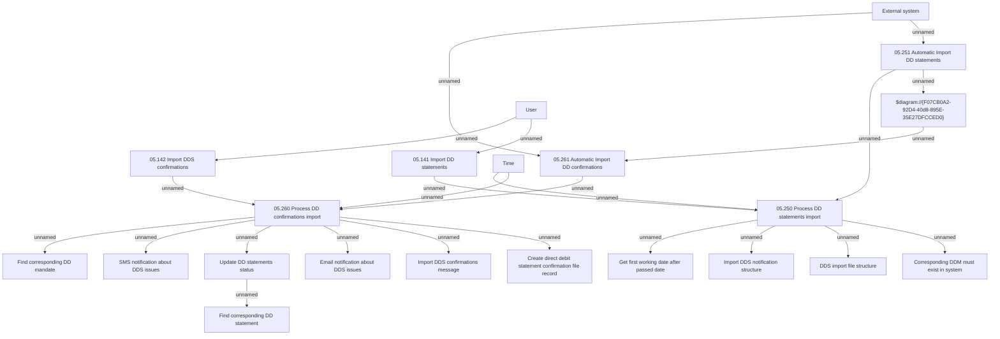

# Automatic import DD statements and confirmations

```mermaid
graph TD
    n_05_142_Import_DDS_confirmations["05.142 Import DDS confirmations"]
    n_05_141_Import_DD_statements["05.141 Import DD statements"]
    Get_first_working_date_after_passed_date["Get first working date after passed date"]
    diagram_F07CB0A2_92D4_40d8_895E_35E27DFCCED0["$diagram://{F07CB0A2-92D4-40d8-895E-35E27DFCCED0}"]
    Find_corresponding_DD_statement["Find corresponding DD statement"]
    Email_notification_about_DDS_issues["Email notification about DDS issues"]
    SMS_notification_about_DDS_issues["SMS notification about DDS issues"]
    Find_corresponding_DD_mandate["Find corresponding DD mandate"]
    Update_DD_statements_status["Update DD statements status"]
    Create_direct_debit_statement_confirmation_file_record["Create direct debit statement confirmation file record"]
    Import_DDS_notification_structure["Import DDS notification structure"]
    Import_DDS_confirmations_message["Import DDS confirmations message"]
    Corresponding_DDM_must_exist_in_system["Corresponding DDM must exist in system"]
    DDS_import_file_structure["DDS import file structure"]
    Time["Time"]
    User["User"]
    External_system["External system"]
    n_05_260_Process_DD_confirmations_import["05.260 Process DD confirmations import"]
    n_05_250_Process_DD_statements_import["05.250 Process DD statements import"]
    n_05_261_Automatic_Import_DD_confirmations["05.261 Automatic Import DD confirmations"]
    n_05_251_Automatic_Import_DD_statements["05.251 Automatic Import DD statements"]
    n_05_260_Process_DD_confirmations_import -->|unnamed| Find_corresponding_DD_mandate
    n_05_141_Import_DD_statements -->|unnamed| n_05_250_Process_DD_statements_import
    diagram_F07CB0A2_92D4_40d8_895E_35E27DFCCED0 -->|unnamed| n_05_261_Automatic_Import_DD_confirmations
    Update_DD_statements_status -->|unnamed| Find_corresponding_DD_statement
    n_05_142_Import_DDS_confirmations -->|unnamed| n_05_260_Process_DD_confirmations_import
    n_05_260_Process_DD_confirmations_import -->|unnamed| SMS_notification_about_DDS_issues
    n_05_251_Automatic_Import_DD_statements -->|unnamed| n_05_250_Process_DD_statements_import
    n_05_260_Process_DD_confirmations_import -->|unnamed| Update_DD_statements_status
    n_05_260_Process_DD_confirmations_import -->|unnamed| Email_notification_about_DDS_issues
    n_05_260_Process_DD_confirmations_import -->|unnamed| Import_DDS_confirmations_message
    n_05_250_Process_DD_statements_import -->|unnamed| Get_first_working_date_after_passed_date
    n_05_250_Process_DD_statements_import -->|unnamed| Import_DDS_notification_structure
    n_05_250_Process_DD_statements_import -->|unnamed| DDS_import_file_structure
    n_05_250_Process_DD_statements_import -->|unnamed| Corresponding_DDM_must_exist_in_system
    n_05_261_Automatic_Import_DD_confirmations -->|unnamed| n_05_260_Process_DD_confirmations_import
    n_05_251_Automatic_Import_DD_statements -->|unnamed| diagram_F07CB0A2_92D4_40d8_895E_35E27DFCCED0
    n_05_260_Process_DD_confirmations_import -->|unnamed| Create_direct_debit_statement_confirmation_file_record
    External_system -->|unnamed| n_05_261_Automatic_Import_DD_confirmations
    External_system -->|unnamed| n_05_251_Automatic_Import_DD_statements
    Time -->|unnamed| n_05_250_Process_DD_statements_import
    Time -->|unnamed| n_05_260_Process_DD_confirmations_import
    User -->|unnamed| n_05_142_Import_DDS_confirmations
    User -->|unnamed| n_05_141_Import_DD_statements
```
