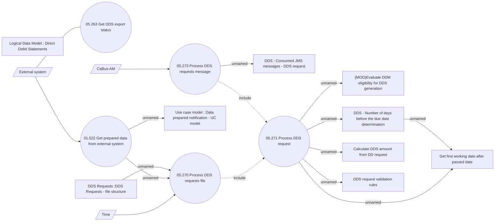

# DDS requests from external systems

- **Diagram Type**: Use Case
- **Package**: HomerSelect/BSL/Analysis Model/Payments/Direct Debit Statements/Use Case
- **Diagram ID**: 162816
- **Elements**: 17
- **Connectors**: 16

