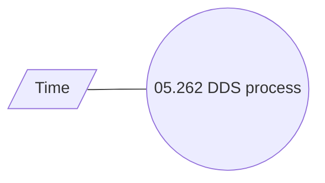

# DDS requests via rabbit MQ

- **Diagram Type**: Use Case
- **Package**: HomerSelect/BSL/Analysis Model/Payments/Direct Debit Statements/Use Case
- **Diagram ID**: 162817
- **Elements**: 2
- **Connectors**: 1

