# Direct Debit statements

- **Diagram Type**: Use Case
- **Package**: HomerSelect/BSL/Analysis Model/Payments/Direct Debit Statements/Use Case
- **Diagram ID**: 162814
- **Elements**: 43
- **Connectors**: 50

```mermaid
graph LR
    n_05_262_DDS_process(("05.262 DDS process"))
    ADD_05_161_Export_DDS_files(("{ADD}05.161 Export DDS files"))
    MOD_Evaluate_DDM_eligibility_for_DDS_generation["{MOD}Evaluate DDM eligibility for DDS generation"]
    Get_first_working_date_before_passed_date["Get first working date before passed date"]
    n_05_142_Import_DDS_confirmations(("05.142 Import DDS confirmations"))
    n_05_141_Import_DD_statements(("05.141 Import DD statements"))
    Get_first_working_date_after_passed_date["Get first working date after passed date"]
    DDS_Import_DDS_Import["DDS_Import : DDS_Import"]
    MOD_05_160_Generate_DD_statement_file(("{MOD}05.160 Generate DD statement file"))
    DDS_Confirmation_DDS_Confirmation["DDS_Confirmation : DDS_Confirmation"]
    diagram_F07CB0A2_92D4_40d8_895E_35E27DFCCED0["$diagram://{F07CB0A2-92D4-40d8-895E-35E27DFCCED0}"]
    Calculate_current_unpaid_installment_amount["Calculate current unpaid installment amount"]
    External_system[/"External system"/]
    n_05_261_Automatic_Import_DD_confirmations(("05.261 Automatic Import DD confirmations"))
    n_05_251_Automatic_Import_DD_statements(("05.251 Automatic Import DD statements"))
    Calculate_all_unpaid_installments_amount["Calculate all unpaid installments amount"]
    Calculate_standard_unpaid_installments_amount["Calculate standard unpaid installments amount"]
    Calculate_DDS_amount["Calculate DDS amount"]
    Email_notification_about_DDS_issues["Email notification about DDS issues"]
    SMS_notification_about_DDS_issues["SMS notification about DDS issues"]
    DDM_Statements_Export["DDM Statements Export"]
    Find_corresponding_DD_mandate["Find corresponding DD mandate"]
    Corresponding_DDM_must_exist_in_system["Corresponding DDM must exist in system"]
    Direct_Debit_Statement_detail_Direct_Debit_Statement_detail["Direct Debit Statement detail  : Direct Debit Statement detail "]
    Browse_DD_Statements_Browse_DD_Statements["Browse DD Statements : Browse DD Statements"]
    Import_DDS_confirmations_message["Import DDS confirmations message"]
    Find_corresponding_DD_statement["Find corresponding DD statement"]
    Update_DD_statements_status["Update DD statements status"]
    Create_direct_debit_statement_confirmation_file_record["Create direct debit statement confirmation file record"]
    DDS_confirmation_file_structure["DDS confirmation file structure"]
    Import_DDS_notification_structure["Import DDS notification structure"]
    Rule_for_generating_DDS_file["Rule for generating DDS file"]
    DDS_Get_DD_channel["DDS - Get DD channel"]
    DDS_Number_of_days_before_the_due_date_determination["DDS - Number of days before the due date determination"]
    Import_files_grid_Import_files_grid["Import files grid : Import files grid"]
    DDS_import_file_structure["DDS import file structure"]
    n_05_260_Process_DD_confirmations_import(("05.260 Process DD confirmations import"))
    n_05_250_Process_DD_statements_import(("05.250 Process DD statements import"))
    Time[/"Time"/]
    n_05_170_Show_DD_statement_detail(("05.170 Show DD statement detail"))
    n_05_150_Browse_DD_statements(("05.150 Browse DD statements"))
    n_05_130_Generate_DD_statements(("05.130 Generate DD statements"))
    User[/"User"/]
    n_05_261_Automatic_Import_DD_confirmations -->|unnamed| n_05_260_Process_DD_confirmations_import
    ADD_05_161_Export_DDS_files -->|unnamed| MOD_05_160_Generate_DD_statement_file
    n_05_260_Process_DD_confirmations_import -->|unnamed| Update_DD_statements_status
    n_05_260_Process_DD_confirmations_import -->|unnamed| Find_corresponding_DD_mandate
    n_05_260_Process_DD_confirmations_import -->|unnamed| SMS_notification_about_DDS_issues
    n_05_260_Process_DD_confirmations_import -->|unnamed| Create_direct_debit_statement_confirmation_file_record
    DDS_Number_of_days_before_the_due_date_determination -->|unnamed| Get_first_working_date_after_passed_date
    Update_DD_statements_status -->|unnamed| Find_corresponding_DD_statement
    Browse_DD_Statements_Browse_DD_Statements -->|unnamed| n_05_150_Browse_DD_statements
    Direct_Debit_Statement_detail_Direct_Debit_Statement_detail -->|unnamed| n_05_170_Show_DD_statement_detail
    Calculate_standard_unpaid_installments_amount -->|unnamed| Calculate_DDS_amount
    n_05_260_Process_DD_confirmations_import -->|unnamed| DDS_confirmation_file_structure
    n_05_251_Automatic_Import_DD_statements -->|unnamed| n_05_250_Process_DD_statements_import
    n_05_260_Process_DD_confirmations_import -->|unnamed| Import_DDS_confirmations_message
    Calculate_current_unpaid_installment_amount -->|unnamed| Calculate_DDS_amount
    diagram_F07CB0A2_92D4_40d8_895E_35E27DFCCED0 -->|unnamed| n_05_261_Automatic_Import_DD_confirmations
    diagram_F07CB0A2_92D4_40d8_895E_35E27DFCCED0 -->|unnamed| n_05_251_Automatic_Import_DD_statements
    DDS_Confirmation_DDS_Confirmation -->|unnamed| n_05_260_Process_DD_confirmations_import
    MOD_05_160_Generate_DD_statement_file -->|unnamed| Rule_for_generating_DDS_file
    DDS_Import_DDS_Import -->|unnamed| n_05_250_Process_DD_statements_import
    n_05_141_Import_DD_statements -->|unnamed| n_05_250_Process_DD_statements_import
    n_05_142_Import_DDS_confirmations -->|unnamed| n_05_260_Process_DD_confirmations_import
    Calculate_all_unpaid_installments_amount -->|unnamed| Calculate_DDS_amount
    n_05_130_Generate_DD_statements -->|unnamed| MOD_05_160_Generate_DD_statement_file
    n_05_130_Generate_DD_statements -->|unnamed| DDS_Number_of_days_before_the_due_date_determination
    n_05_130_Generate_DD_statements -->|unnamed| Calculate_DDS_amount
    n_05_130_Generate_DD_statements -->|unnamed| Get_first_working_date_before_passed_date
    n_05_130_Generate_DD_statements -->|unnamed| Get_first_working_date_after_passed_date
    n_05_130_Generate_DD_statements -->|unnamed| DDS_Get_DD_channel
    n_05_130_Generate_DD_statements -->|unnamed| DDM_Statements_Export
    n_05_260_Process_DD_confirmations_import -->|unnamed| Email_notification_about_DDS_issues
    n_05_170_Show_DD_statement_detail -->|unnamed| Browse_DD_Statements_Browse_DD_Statements
    n_05_250_Process_DD_statements_import -->|unnamed| Get_first_working_date_before_passed_date
    n_05_250_Process_DD_statements_import -->|unnamed| DDS_Get_DD_channel
    n_05_250_Process_DD_statements_import -->|unnamed| Corresponding_DDM_must_exist_in_system
    n_05_250_Process_DD_statements_import -->|unnamed| DDS_import_file_structure
    n_05_250_Process_DD_statements_import -->|unnamed| Import_DDS_notification_structure
    n_05_250_Process_DD_statements_import -->|unnamed| Get_first_working_date_after_passed_date
    n_05_130_Generate_DD_statements -->|unnamed| MOD_Evaluate_DDM_eligibility_for_DDS_generation
    External_system --- n_05_261_Automatic_Import_DD_confirmations
    External_system --- n_05_251_Automatic_Import_DD_statements
    Time --- n_05_130_Generate_DD_statements
    Time --- n_05_262_DDS_process
    Time --> n_05_250_Process_DD_statements_import
    Time --> MOD_05_160_Generate_DD_statement_file
    Time --> n_05_260_Process_DD_confirmations_import
    User --> n_05_150_Browse_DD_statements
    User --> n_05_142_Import_DDS_confirmations
    User --> n_05_141_Import_DD_statements
    User --> n_05_170_Show_DD_statement_detail
```

