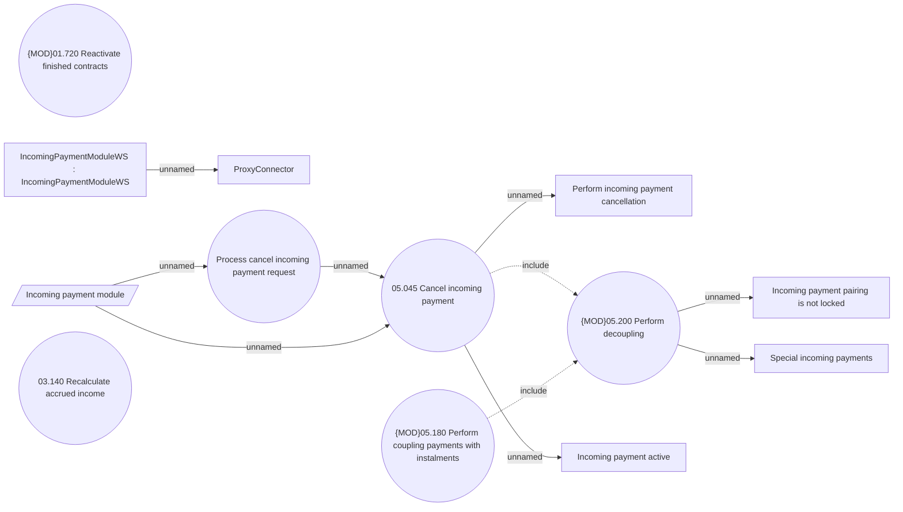

# Cancellation incoming payment manually

- **Diagram Type**: Use Case
- **Package**: HomerSelect/BSL/Analysis Model/Payments/Incoming payments/Management of incoming payments /Use Case Model
- **Diagram ID**: 162010
- **Elements**: 13
- **Connectors**: 10

