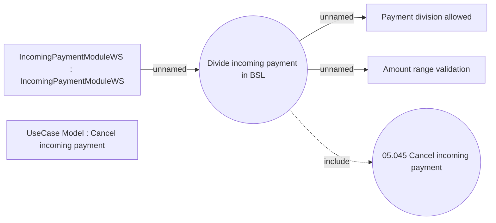

# Divide incoming payment

- **Diagram Type**: Use Case
- **Package**: HomerSelect/BSL/Analysis Model/Payments/Incoming payments/Management of incoming payments /Use Case Model
- **Diagram ID**: 162011
- **Elements**: 6
- **Connectors**: 4

