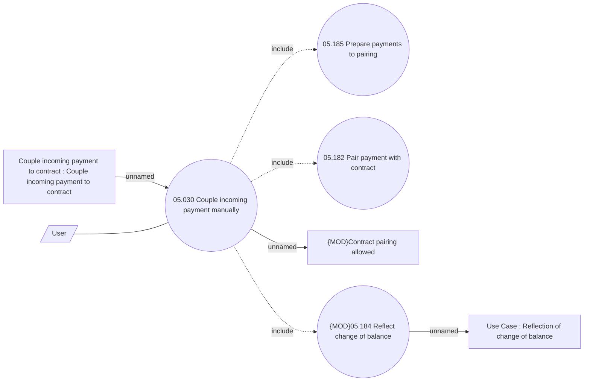

# Manual pairing of incoming payment with contract

- **Diagram Type**: Use Case
- **Package**: HomerSelect/BSL/Analysis Model/Payments/Incoming payments/Pairing incomming payments/Use Case Model
- **Diagram ID**: 161907
- **Elements**: 8
- **Connectors**: 7

