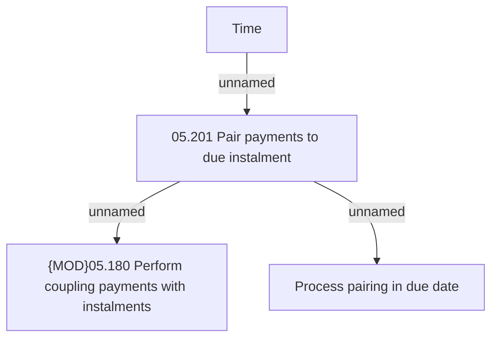

# Pair prepayments to due instalments

```mermaid
graph TD
    MOD_05_180_Perform_coupling_payments_with_instalments["{MOD}05.180 Perform coupling payments with instalments"]
    Process_pairing_in_due_date["Process pairing in due date"]
    n_05_201_Pair_payments_to_due_instalment["05.201 Pair payments to due instalment"]
    Time["Time"]
    Time -->|unnamed| n_05_201_Pair_payments_to_due_instalment
    n_05_201_Pair_payments_to_due_instalment -->|unnamed| MOD_05_180_Perform_coupling_payments_with_instalments
    n_05_201_Pair_payments_to_due_instalment -->|unnamed| Process_pairing_in_due_date
```
