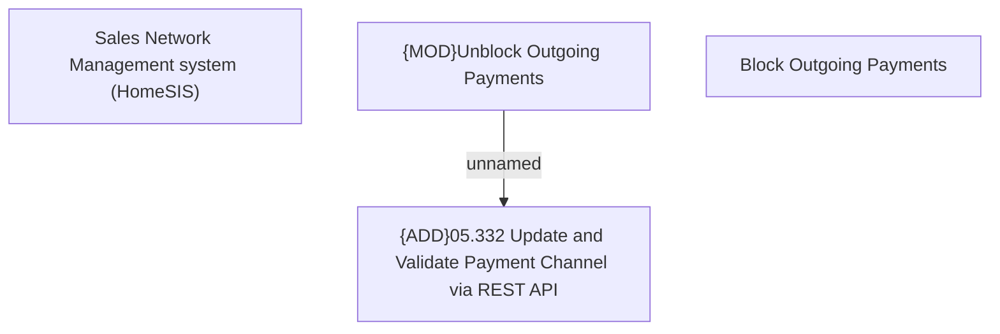

# Blocking outgoing payments

```mermaid
graph TD
    ADD_05_332_Update_and_Validate_Payment_Channel_via_REST_API["{ADD}05.332 Update and Validate Payment Channel via REST API"]
    Sales_Network_Management_system_HomeSIS["Sales Network Management system (HomeSIS)"]
    MOD_Unblock_Outgoing_Payments["{MOD}Unblock Outgoing Payments"]
    Block_Outgoing_Payments["Block Outgoing Payments"]
    MOD_Unblock_Outgoing_Payments -->|unnamed| ADD_05_332_Update_and_Validate_Payment_Channel_via_REST_API
```
