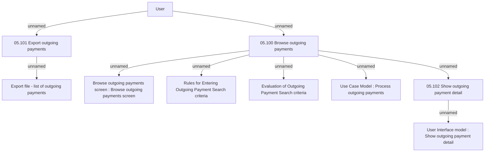

# Browse Outgoing Payments

```mermaid
graph TD
    User_Interface_model_Show_outgoing_payment_detail["User Interface model : Show outgoing payment detail"]
    n_05_102_Show_outgoing_payment_detail["05.102 Show outgoing payment detail"]
    Export_file_list_of_outgoing_payments["Export file - list of outgoing payments"]
    n_05_101_Export_outgoing_payments["05.101 Export outgoing payments"]
    Use_Case_Model_Process_outgoing_payments["Use Case Model : Process outgoing payments"]
    Evaluation_of_Outgoing_Payment_Search_criteria["Evaluation of Outgoing Payment Search criteria"]
    Rules_for_Entering_Outgoing_Payment_Search_criteria["Rules for Entering Outgoing Payment Search criteria"]
    Browse_outgoing_payments_screen_Browse_outgoing_payments_scr["Browse outgoing payments screen : Browse outgoing payments screen"]
    User["User"]
    n_05_100_Browse_outgoing_payments["05.100 Browse outgoing payments"]
    n_05_102_Show_outgoing_payment_detail -->|unnamed| User_Interface_model_Show_outgoing_payment_detail
    n_05_100_Browse_outgoing_payments -->|unnamed| Browse_outgoing_payments_screen_Browse_outgoing_payments_scr
    n_05_100_Browse_outgoing_payments -->|unnamed| Rules_for_Entering_Outgoing_Payment_Search_criteria
    n_05_100_Browse_outgoing_payments -->|unnamed| Evaluation_of_Outgoing_Payment_Search_criteria
    n_05_100_Browse_outgoing_payments -->|unnamed| Use_Case_Model_Process_outgoing_payments
    n_05_101_Export_outgoing_payments -->|unnamed| Export_file_list_of_outgoing_payments
    n_05_100_Browse_outgoing_payments -->|unnamed| n_05_102_Show_outgoing_payment_detail
    User -->|unnamed| n_05_101_Export_outgoing_payments
    User -->|unnamed| n_05_100_Browse_outgoing_payments
```
