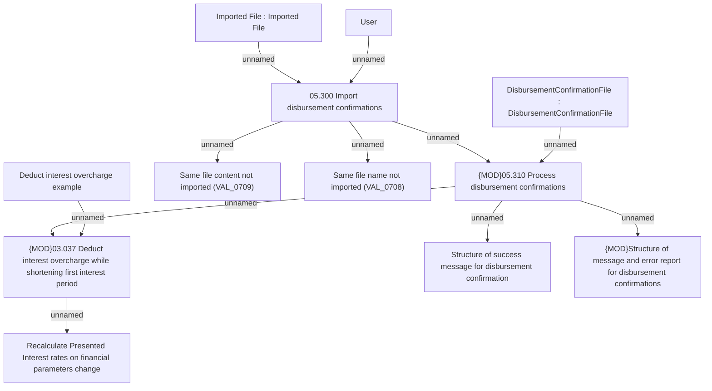

# Disbursement confirmations

```mermaid
graph TD
    Deduct_interest_overcharge_example["Deduct interest overcharge example"]
    Recalculate_Presented_Interest_rates_on_financial_parameters["Recalculate Presented Interest rates on financial parameters change"]
    MOD_03_037_Deduct_interest_overcharge_while_shortening_first["{MOD}03.037 Deduct interest overcharge while shortening first interest period"]
    Imported_File_Imported_File["Imported File : Imported File"]
    Structure_of_success_message_for_disbursement_confirmation["Structure of success message for disbursement confirmation"]
    MOD_Structure_of_message_and_error_report_for_disbursement_c["{MOD}Structure of message and error report for disbursement confirmations"]
    Same_file_content_not_imported_VAL_0709["Same file content not imported (VAL_0709)"]
    Same_file_name_not_imported_VAL_0708["Same file name not imported (VAL_0708)"]
    DisbursementConfirmationFile_DisbursementConfirmationFile["DisbursementConfirmationFile : DisbursementConfirmationFile"]
    User["User"]
    MOD_05_310_Process_disbursement_confirmations["{MOD}05.310 Process disbursement confirmations"]
    n_05_300_Import_disbursement_confirmations["05.300 Import disbursement confirmations"]
    Imported_File_Imported_File -->|unnamed| n_05_300_Import_disbursement_confirmations
    n_05_300_Import_disbursement_confirmations -->|unnamed| MOD_05_310_Process_disbursement_confirmations
    DisbursementConfirmationFile_DisbursementConfirmationFile -->|unnamed| MOD_05_310_Process_disbursement_confirmations
    n_05_300_Import_disbursement_confirmations -->|unnamed| Same_file_name_not_imported_VAL_0708
    n_05_300_Import_disbursement_confirmations -->|unnamed| Same_file_content_not_imported_VAL_0709
    MOD_05_310_Process_disbursement_confirmations -->|unnamed| MOD_Structure_of_message_and_error_report_for_disbursement_c
    MOD_05_310_Process_disbursement_confirmations -->|unnamed| Structure_of_success_message_for_disbursement_confirmation
    MOD_05_310_Process_disbursement_confirmations -->|unnamed| MOD_03_037_Deduct_interest_overcharge_while_shortening_first
    User -->|unnamed| n_05_300_Import_disbursement_confirmations
    Deduct_interest_overcharge_example -->|unnamed| MOD_03_037_Deduct_interest_overcharge_while_shortening_first
    MOD_03_037_Deduct_interest_overcharge_while_shortening_first -->|unnamed| Recalculate_Presented_Interest_rates_on_financial_parameters
```
