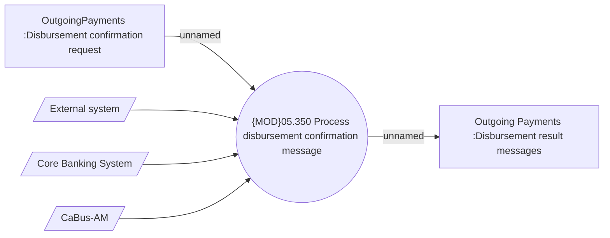

# Processing disbursement confirmation message

- **Diagram Type**: Use Case
- **Package**: HomerSelect/BSL/Analysis Model/Payments/Outgoing payments/Disbursement confirmation/Use Case Model
- **Diagram ID**: 164109
- **Elements**: 6
- **Connectors**: 5

