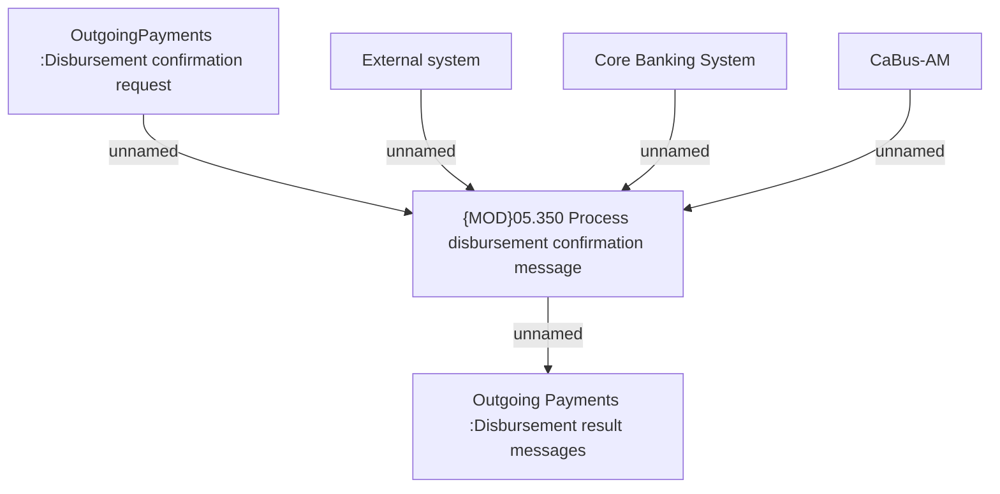

# Processing disbursement confirmation message

```mermaid
graph TD
    External_system["External system"]
    Outgoing_Payments_Disbursement_result_messages["Outgoing Payments :Disbursement result messages"]
    CaBus_AM["CaBus-AM"]
    OutgoingPayments_Disbursement_confirmation_request["OutgoingPayments :Disbursement confirmation request"]
    Core_Banking_System["Core Banking System"]
    MOD_05_350_Process_disbursement_confirmation_message["{MOD}05.350 Process disbursement confirmation message"]
    OutgoingPayments_Disbursement_confirmation_request -->|unnamed| MOD_05_350_Process_disbursement_confirmation_message
    MOD_05_350_Process_disbursement_confirmation_message -->|unnamed| Outgoing_Payments_Disbursement_result_messages
    External_system -->|unnamed| MOD_05_350_Process_disbursement_confirmation_message
    Core_Banking_System -->|unnamed| MOD_05_350_Process_disbursement_confirmation_message
    CaBus_AM -->|unnamed| MOD_05_350_Process_disbursement_confirmation_message
```
