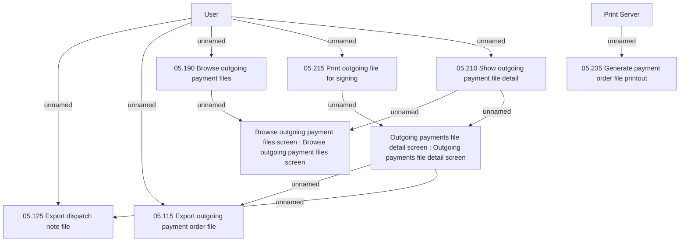

# Outgoing payment files management

```mermaid
graph TD
    Print_Server["Print Server"]
    n_05_125_Export_dispatch_note_file["05.125 Export dispatch note file"]
    n_05_215_Print_outgoing_file_for_signing["05.215 Print outgoing file for signing"]
    Outgoing_payments_file_detail_screen_Outgoing_payments_file_["Outgoing payments file detail screen : Outgoing payments file detail screen"]
    Browse_outgoing_payment_files_screen_Browse_outgoing_payment["Browse outgoing payment files screen : Browse outgoing payment files screen"]
    n_05_115_Export_outgoing_payment_order_file["05.115 Export outgoing payment order file"]
    n_05_210_Show_outgoing_payment_file_detail["05.210 Show outgoing payment file detail"]
    n_05_190_Browse_outgoing_payment_files["05.190 Browse outgoing payment files"]
    User["User"]
    n_05_235_Generate_payment_order_file_printout["05.235 Generate payment order file printout"]
    Outgoing_payments_file_detail_screen_Outgoing_payments_file_ -->|unnamed| n_05_115_Export_outgoing_payment_order_file
    n_05_210_Show_outgoing_payment_file_detail -->|unnamed| Browse_outgoing_payment_files_screen_Browse_outgoing_payment
    n_05_190_Browse_outgoing_payment_files -->|unnamed| Browse_outgoing_payment_files_screen_Browse_outgoing_payment
    n_05_210_Show_outgoing_payment_file_detail -->|unnamed| Outgoing_payments_file_detail_screen_Outgoing_payments_file_
    n_05_215_Print_outgoing_file_for_signing -->|unnamed| Outgoing_payments_file_detail_screen_Outgoing_payments_file_
    Outgoing_payments_file_detail_screen_Outgoing_payments_file_ -->|unnamed| n_05_125_Export_dispatch_note_file
    User -->|unnamed| n_05_125_Export_dispatch_note_file
    User -->|unnamed| n_05_115_Export_outgoing_payment_order_file
    User -->|unnamed| n_05_190_Browse_outgoing_payment_files
    User -->|unnamed| n_05_215_Print_outgoing_file_for_signing
    User -->|unnamed| n_05_210_Show_outgoing_payment_file_detail
    Print_Server -->|unnamed| n_05_235_Generate_payment_order_file_printout
```
